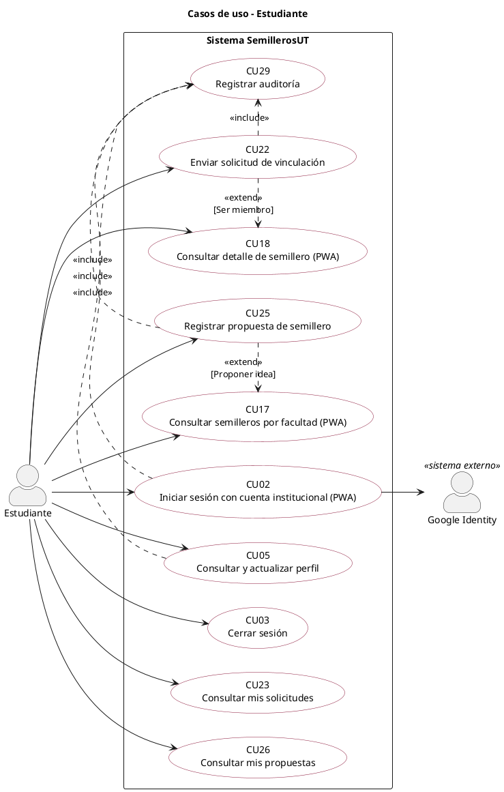
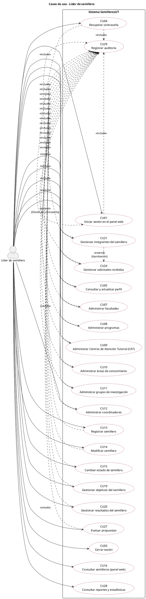
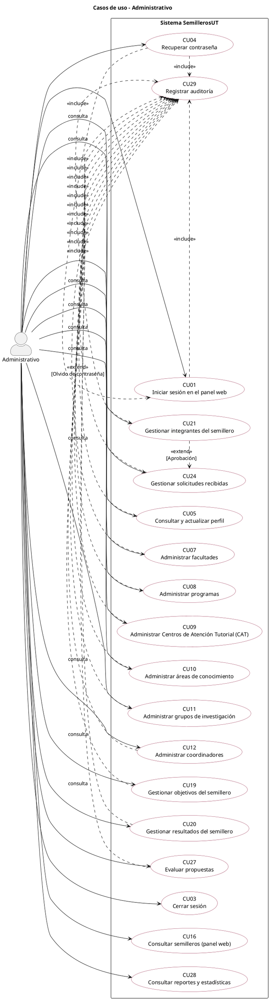
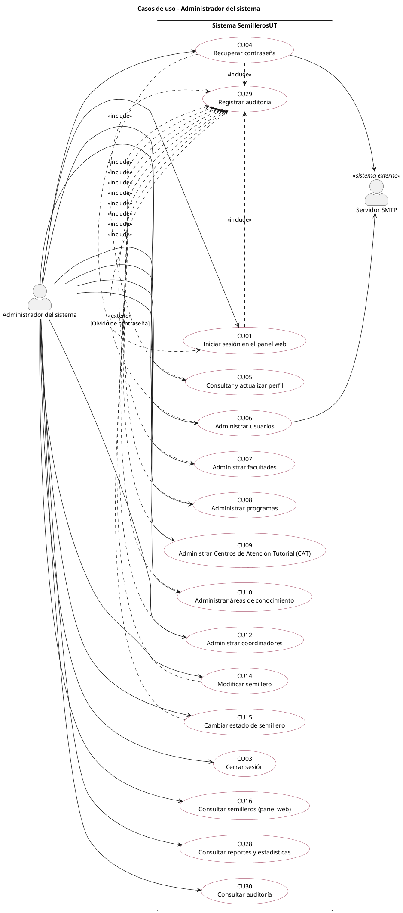

# Especificación de Requerimientos y Casos de Uso
## SemillerosUT — Gestión, suscripción y divulgación de los Semilleros de Investigación del IDEAD – Universidad del Tolima

| Campo | Detalle |
|---|---|
| Documento | Especificación de requerimientos funcionales, no funcionales y casos de uso extendidos |
| Proyecto base | *Diseño de una aplicación móvil para la gestión de información de los semilleros de investigación en el IDEAD de la Universidad del Tolima* (INITIUM, 2020) |
| Adaptación y elaboración | José Bohórquez — Aprendiz SENA ADSO, ficha 3311941 |
| Stack | Laravel 12 (PHP 8.2+) · HTML5, CSS3, JavaScript, Bootstrap 5 · PWA instalable · MongoDB · API REST (Sanctum) |
| Versión | 1.0 |
| Fecha | `<dd/mm/aaaa>` |
| Relación con la documentación técnica | Reemplaza y amplía las secciones 1.4 (requerimientos) y 1.5 (casos de uso) de `Documentacion_Tecnica_SemillerosUT.md` |

---

## Contenido

1. [Introducción](#1-introducción)
2. [Actores del sistema](#2-actores-del-sistema)
3. [Reglas de negocio](#3-reglas-de-negocio)
4. [Requerimientos funcionales](#4-requerimientos-funcionales)
5. [Requerimientos no funcionales](#5-requerimientos-no-funcionales)
6. [Modelo de casos de uso](#6-modelo-de-casos-de-uso)
7. [Especificación extendida de casos de uso](#7-especificación-extendida-de-casos-de-uso)
8. [Matrices de trazabilidad](#8-matrices-de-trazabilidad)
9. [Historial de cambios](#9-historial-de-cambios)

---

## 1. Introducción

### 1.1 Propósito

Definir de forma completa y verificable qué debe hacer el sistema SemillerosUT (requerimientos funcionales), con qué atributos de calidad (requerimientos no funcionales) y cómo interactúan los actores con él (casos de uso), como base para el diseño, la codificación, las pruebas y la aceptación.

### 1.2 Alcance

El sistema está formado por un **panel web administrativo** (Administrador del sistema, Líder de semillero y Administrativo), una **PWA instalable** para estudiantes y una **API REST** que los conecta con la base de datos. El piloto se despliega en el CAT Kennedy (Bogotá).

### 1.3 Convenciones

| Prefijo | Significado |
|---|---|
| RF | Requerimiento funcional |
| RNF | Requerimiento no funcional |
| RN | Regla de negocio |
| CU | Caso de uso |
| HU | Historia de usuario (ver documentación técnica, sección 1.4) |
| A*n* / E*n* | Flujo alterno / excepción dentro de un caso de uso |

Prioridad: **Alta** (imprescindible para la versión 1.0), **Media** (importante, puede entregarse en un incremento posterior), **Baja** (deseable).

### 1.4 Refinamiento respecto al documento original

El diseño de 2020 tenía 14 casos de uso del tipo «Gestión de X». Se refinaron en **30 casos de uso** separando las metas de cada actor (por ejemplo, *Gestión de solicitudes* se dividió en *Enviar*, *Consultar mis solicitudes* y *Gestionar solicitudes recibidas*). Los catálogos (facultades, programas, CAT, áreas, grupos, coordinadores) se mantienen como un caso de uso cada uno con sus operaciones (crear, consultar, modificar, cambiar estado) como flujos, práctica habitual para operaciones de mantenimiento simples. También se corrigió el modelado de la auditoría: deja de tener al «sistema» como actor y pasa a ser un caso de uso de inclusión (CU29) más un caso de consulta (CU30).

| CU original (2020) | Casos de uso refinados |
|---|---|
| CU01 Gestión de usuarios | CU01, CU02, CU03, CU04, CU05, CU06 |
| CU02 Gestión de facultades | CU07 |
| CU03 Gestión de programas | CU08 |
| CU04 Gestión de CAT | CU09 |
| CU05 Gestión de áreas | CU10 |
| CU06 Gestión de grupos | CU11 |
| CU07 Gestión de coordinadores | CU12 |
| CU08 Gestión de objetivos | CU19 |
| CU09 Gestión de resultados | CU20 |
| CU10 Gestión de solicitudes | CU22, CU23, CU24 |
| CU11 Gestión de propuestas | CU25, CU26, CU27 |
| CU12 Gestión de integrantes | CU21 |
| CU13 Gestión de semilleros | CU13, CU14, CU15, CU16, CU17, CU18 |
| CU14 Registro de auditoría | CU29, CU30 |
| — (nuevo) | CU28 Consultar reportes y estadísticas |

---

## 2. Actores del sistema

| Actor | Tipo | Descripción | Canal |
|---|---|---|---|
| Usuario | Abstracto | Generaliza a todos los usuarios autenticados (cerrar sesión, perfil). | — |
| Usuario web | Abstracto | Generaliza a Administrador, Líder y Administrativo. | Panel web |
| Administrador del sistema | Principal, humano | Administra usuarios, catálogos (facultades, programas, CAT, áreas, coordinadores) y consulta la auditoría. | Panel web |
| Líder de semillero | Principal, humano | Docente tutor responsable de uno o varios semilleros: los registra y mantiene, gestiona grupos, objetivos, resultados, integrantes y solicitudes. | Panel web |
| Administrativo | Principal, humano | Director de programa, coordinador de CAT o coordinación de investigación del IDEAD: consulta toda la información y evalúa propuestas. | Panel web |
| Estudiante | Principal, humano | Estudiante activo de la universidad: consulta semilleros, solicita vinculación y registra propuestas. | PWA |
| Google Identity | Secundario, sistema externo | Autentica a los estudiantes con su cuenta institucional (OAuth 2.0). | — |
| Servidor de correo (SMTP) | Secundario, sistema externo | Envía correos de activación y recuperación de contraseña. | — |

Jerarquía: `Administrador`, `Líder` y `Administrativo` → especializan a `Usuario web`; `Usuario web` y `Estudiante` → especializan a `Usuario`.

---

## 3. Reglas de negocio

| ID | Regla |
|---|---|
| RN01 | No se elimina físicamente ningún registro. La baja se hace cambiando el estado a «inactivo». |
| RN02 | Un usuario del panel web solo se crea con autorización escrita del área administrativa; su referencia se registra en el usuario. |
| RN03 | Un semillero solo se crea con aprobación escrita del área administrativa (Acuerdo 0033 de 2018); su referencia se registra en el semillero. |
| RN04 | A la PWA solo acceden estudiantes con correo del dominio institucional verificado por Google. |
| RN05 | Un estudiante puede tener como máximo una solicitud pendiente por semillero y no puede solicitar un semillero del que ya es integrante activo. |
| RN06 | Un líder solo modifica los semilleros de los que es responsable, y sus objetivos, resultados, integrantes y solicitudes. El Administrador puede modificar cualquiera. |
| RN07 | Toda creación, modificación, cambio de estado e inicio de sesión genera un registro de auditoría que no se puede modificar ni eliminar. |
| RN08 | Los códigos de facultad, programa, CAT, área, grupo y semillero, el documento del coordinador y el correo del usuario son únicos. |
| RN09 | El estudiante debe aceptar la autorización de tratamiento de datos personales antes de usar la PWA. |
| RN10 | Las contraseñas tienen mínimo 8 caracteres, con al menos una mayúscula, una minúscula, un número y un símbolo, y se almacenan solo como hash. |
| RN11 | En la PWA solo se muestran semilleros activos, y solo los semilleros activos reciben solicitudes. |
| RN12 | Un estudiante no puede estar registrado dos veces como integrante activo del mismo semillero. |
| RN13 | Un estudiante solo puede consultar sus propias solicitudes y propuestas. |
| RN14 | Tras 5 intentos fallidos de inicio de sesión en un minuto (mismo correo e IP), se bloquean los intentos durante 60 segundos. |
| RN15 | Un estudiante puede registrar como máximo 5 propuestas en 24 horas. |

---

## 4. Requerimientos funcionales

### 4.1 Listado

| ID | Nombre | Prioridad | Casos de uso |
|---|---|---|---|
| RF01 | Gestión de usuarios y autenticación | Alta | CU01, CU02, CU03, CU04, CU05, CU06 |
| RF02 | Gestión de facultades | Alta | CU07 |
| RF03 | Gestión de programas | Alta | CU08 |
| RF04 | Gestión de Centros de Atención Tutorial (CAT) | Alta | CU09 |
| RF05 | Gestión de áreas de conocimiento | Alta | CU10 |
| RF06 | Gestión de grupos de investigación | Alta | CU11 |
| RF07 | Gestión de coordinadores | Alta | CU12 |
| RF08 | Gestión de objetivos | Alta | CU18, CU19 |
| RF09 | Gestión de resultados | Alta | CU20 |
| RF10 | Gestión de solicitudes de vinculación | Alta | CU22, CU23, CU24 |
| RF11 | Gestión de propuestas | Alta | CU25, CU26, CU27 |
| RF12 | Gestión de integrantes | Alta | CU21 |
| RF13 | Gestión de semilleros | Alta | CU13, CU14, CU15, CU16, CU17, CU18 |
| RF14 | Registro y consulta de auditoría | Alta | CU29, CU30 |
| RF15 | Reportes y estadísticas (nuevo) | Media | CU28 |
| RF16 | Autorización de tratamiento de datos personales (nuevo) | Alta | CU02 |

> RF01 a RF14 provienen del documento original (Anexo B), ampliados. RF15 y RF16 se agregan en la adaptación: RF15 por el uso de agregaciones para reportes y RF16 por el marco legal (Ley 1581 de 2012) que el documento original ya exigía pero no había convertido en requerimiento.

### 4.2 Especificación

#### RF01 – Gestión de usuarios y autenticación

| Campo | Descripción |
|---|---|
| Identificador | RF01 |
| Nombre | Gestión de usuarios y autenticación |
| Actores | Administrador del sistema; todos los roles (autenticación y perfil) |
| Descripción | El sistema debe permitir listar, crear, consultar, modificar y activar o inactivar usuarios, así como iniciar sesión (correo y contraseña en web; Google institucional en la PWA), cerrar sesión, recuperar la contraseña y consultar o actualizar el perfil. No se permite eliminar usuarios. |
| Entradas | Nombre, correo, rol, referencia de autorización, contraseña (usuarios web), token de Google (estudiantes), teléfono. |
| Procesamiento | Validación de datos y unicidad del correo; hash de la contraseña; verificación de credenciales y estado; emisión de sesión o token; envío de correos de activación y recuperación; revocación de sesiones al inactivar. |
| Salidas | Usuario registrado o actualizado; sesión o token de acceso; correos de activación y recuperación; mensajes de confirmación o error. |
| Criterios de aceptación | • Un usuario inactivo no puede iniciar sesión. • La contraseña nunca se muestra ni se guarda en texto plano. • Un correo fuera del dominio institucional no accede a la PWA. • No existe opción de eliminar usuarios. |
| Reglas de negocio | RN02, RN04, RN08, RN09, RN10, RN14 |
| Casos de uso | CU01, CU02, CU03, CU04, CU05, CU06 |
| Historias de usuario | HU01, HU02, HU03, HU04, HU21 |
| Prioridad | Alta |

#### RF02 – Gestión de facultades

| Campo | Descripción |
|---|---|
| Identificador | RF02 |
| Nombre | Gestión de facultades |
| Actores | Administrador del sistema (escritura); Líder, Administrativo (consulta) |
| Descripción | El sistema debe permitir listar, crear, consultar, modificar y activar o inactivar facultades, base para organizar programas y semilleros. No se permite eliminar facultades. |
| Entradas | Código, nombre. |
| Procesamiento | Validación de obligatorios y unicidad del código; registro con estado activo; auditoría. |
| Salidas | Facultad registrada o actualizada; listado y detalle con programas asociados. |
| Criterios de aceptación | • No se registran dos facultades con el mismo código. • Una facultad inactiva no aparece en los formularios de programas ni semilleros. |
| Reglas de negocio | RN01, RN07, RN08 |
| Casos de uso | CU07 |
| Historias de usuario | HU05 |
| Prioridad | Alta |

#### RF03 – Gestión de programas

| Campo | Descripción |
|---|---|
| Identificador | RF03 |
| Nombre | Gestión de programas |
| Actores | Administrador del sistema (escritura); Líder, Administrativo (consulta) |
| Descripción | El sistema debe permitir listar, crear, consultar, modificar y activar o inactivar los programas académicos, asociados a una facultad. Son la base de solicitudes, propuestas, semilleros e integrantes. No se permite eliminar programas. |
| Entradas | Facultad, código, nombre, tipo (Pregrado / Posgrado). |
| Procesamiento | Validación, verificación de la facultad activa, unicidad del código, registro y auditoría. |
| Salidas | Programa registrado o actualizado. |
| Criterios de aceptación | • Todo programa pertenece a una facultad. • El tipo solo admite Pregrado o Posgrado. |
| Reglas de negocio | RN01, RN07, RN08 |
| Casos de uso | CU08 |
| Historias de usuario | HU06 |
| Prioridad | Alta |

#### RF04 – Gestión de Centros de Atención Tutorial (CAT)

| Campo | Descripción |
|---|---|
| Identificador | RF04 |
| Nombre | Gestión de Centros de Atención Tutorial (CAT) |
| Actores | Administrador del sistema (escritura); Líder, Administrativo (consulta) |
| Descripción | El sistema debe permitir listar, crear, consultar, modificar y activar o inactivar los CAT, sede a la que pertenece cada semillero. No se permite eliminar CAT. |
| Entradas | Código, nombre, dirección, ciudad, correo, teléfono principal y hasta dos adicionales. |
| Procesamiento | Validación de formato de correo y teléfonos, unicidad del código, registro y auditoría. |
| Salidas | CAT registrado o actualizado. |
| Criterios de aceptación | • Todo CAT tiene al menos un teléfono. • No se registran dos CAT con el mismo código. |
| Reglas de negocio | RN01, RN07, RN08 |
| Casos de uso | CU09 |
| Historias de usuario | HU07 |
| Prioridad | Alta |

#### RF05 – Gestión de áreas de conocimiento

| Campo | Descripción |
|---|---|
| Identificador | RF05 |
| Nombre | Gestión de áreas de conocimiento |
| Actores | Administrador del sistema (escritura); Líder, Administrativo (consulta) |
| Descripción | El sistema debe permitir listar, crear, consultar, modificar y activar o inactivar áreas de conocimiento, usadas para clasificar semilleros y propuestas. No se permite eliminar áreas. |
| Entradas | Código, nombre. |
| Procesamiento | Validación, unicidad del código, registro y auditoría. |
| Salidas | Área registrada o actualizada. |
| Criterios de aceptación | • Todo semillero y toda propuesta tiene al menos un área. |
| Reglas de negocio | RN01, RN07, RN08 |
| Casos de uso | CU10 |
| Historias de usuario | HU08 |
| Prioridad | Alta |

#### RF06 – Gestión de grupos de investigación

| Campo | Descripción |
|---|---|
| Identificador | RF06 |
| Nombre | Gestión de grupos de investigación |
| Actores | Líder de semillero (escritura); Administrativo (consulta) |
| Descripción | El sistema debe permitir listar, crear, consultar, modificar y activar o inactivar los grupos de investigación a los que pertenecen los semilleros. No se permite eliminar grupos. |
| Entradas | Código, nombre. |
| Procesamiento | Validación, unicidad del código, registro y auditoría. |
| Salidas | Grupo registrado o actualizado. |
| Criterios de aceptación | • Todo semillero pertenece a un grupo activo. |
| Reglas de negocio | RN01, RN07, RN08 |
| Casos de uso | CU11 |
| Historias de usuario | HU09 |
| Prioridad | Alta |

#### RF07 – Gestión de coordinadores

| Campo | Descripción |
|---|---|
| Identificador | RF07 |
| Nombre | Gestión de coordinadores |
| Actores | Administrador del sistema (escritura); Líder, Administrativo (consulta) |
| Descripción | El sistema debe permitir listar, crear, consultar, modificar y activar o inactivar los coordinadores asignados a los semilleros. No se permite eliminar coordinadores. |
| Entradas | Nombre, documento, correo, teléfono. |
| Procesamiento | Validación, unicidad del documento, registro y auditoría. |
| Salidas | Coordinador registrado o actualizado. |
| Criterios de aceptación | • No se registran dos coordinadores con el mismo documento. • El nombre y correo del coordinador se muestran en el detalle del semillero en la PWA. |
| Reglas de negocio | RN01, RN07, RN08 |
| Casos de uso | CU12 |
| Historias de usuario | HU10 |
| Prioridad | Alta |

#### RF08 – Gestión de objetivos

| Campo | Descripción |
|---|---|
| Identificador | RF08 |
| Nombre | Gestión de objetivos |
| Actores | Líder de semillero (escritura); Administrativo, Estudiante (consulta) |
| Descripción | El sistema debe permitir listar, agregar, consultar, modificar y activar o inactivar los objetivos específicos de cada semillero. No se permite eliminar objetivos. |
| Entradas | Semillero, contenido del objetivo. |
| Procesamiento | Validación de longitud; verificación de que el líder es responsable del semillero; almacenamiento embebido en el semillero; auditoría. |
| Salidas | Objetivo registrado o actualizado, visible en web y PWA. |
| Criterios de aceptación | • Solo los objetivos activos se muestran en la PWA. • Un líder no puede modificar objetivos de semilleros ajenos. |
| Reglas de negocio | RN01, RN06, RN07 |
| Casos de uso | CU18, CU19 |
| Historias de usuario | HU12 |
| Prioridad | Alta |

#### RF09 – Gestión de resultados

| Campo | Descripción |
|---|---|
| Identificador | RF09 |
| Nombre | Gestión de resultados |
| Actores | Líder de semillero (escritura); Administrativo (consulta) |
| Descripción | El sistema debe permitir listar, agregar, consultar, modificar y activar o inactivar los resultados de cada semillero. No se permite eliminar resultados. |
| Entradas | Semillero, contenido, fecha del resultado (opcional). |
| Procesamiento | Igual que RF08. |
| Salidas | Resultado registrado o actualizado. |
| Criterios de aceptación | • Un líder no puede modificar resultados de semilleros ajenos. |
| Reglas de negocio | RN01, RN06, RN07 |
| Casos de uso | CU20 |
| Historias de usuario | HU13 |
| Prioridad | Alta |

#### RF10 – Gestión de solicitudes de vinculación

| Campo | Descripción |
|---|---|
| Identificador | RF10 |
| Nombre | Gestión de solicitudes de vinculación |
| Actores | Estudiante (crea y consulta las propias); Líder (resuelve); Administrativo (consulta) |
| Descripción | El sistema debe permitir al estudiante enviar solicitudes para ser miembro de un semillero y consultar su estado, y al líder listar, consultar, aprobar o rechazar las solicitudes de sus semilleros. No se permite eliminar solicitudes. |
| Entradas | Semillero, programa, teléfono, mensaje; respuesta o motivo del líder. |
| Procesamiento | Validación; control de solicitud pendiente única; registro en estado pendiente; cambio a aprobada o rechazada; creación opcional del integrante; auditoría. |
| Salidas | Solicitud registrada; estado visible para el estudiante; listado para el líder. |
| Criterios de aceptación | • No se admite una segunda solicitud pendiente del mismo estudiante al mismo semillero. • El rechazo exige motivo. • El estudiante solo ve sus solicitudes. |
| Reglas de negocio | RN05, RN06, RN07, RN11, RN13 |
| Casos de uso | CU22, CU23, CU24 |
| Historias de usuario | HU16, HU17, HU20 |
| Prioridad | Alta |

#### RF11 – Gestión de propuestas

| Campo | Descripción |
|---|---|
| Identificador | RF11 |
| Nombre | Gestión de propuestas |
| Actores | Estudiante (crea y consulta las propias); Administrativo (evalúa); Líder (consulta) |
| Descripción | El sistema debe permitir al estudiante registrar ideas de proyecto o de nuevos semilleros asociadas a un programa y a áreas de conocimiento, consultar su estado, y a la coordinación listar, consultar y evaluar las propuestas. No se permite eliminar propuestas. |
| Entradas | Programa, áreas, teléfono (opcional), descripción; observación y estado del evaluador. |
| Procesamiento | Validación; control de límite diario; registro en estado recibida; cambio a viable o archivada; auditoría. |
| Salidas | Propuesta registrada y evaluada. |
| Criterios de aceptación | • Toda propuesta tiene al menos un área. • Archivar exige observación. • El estudiante solo ve sus propuestas. |
| Reglas de negocio | RN01, RN07, RN13, RN15 |
| Casos de uso | CU25, CU26, CU27 |
| Historias de usuario | HU18, HU19, HU20 |
| Prioridad | Alta |

#### RF12 – Gestión de integrantes

| Campo | Descripción |
|---|---|
| Identificador | RF12 |
| Nombre | Gestión de integrantes |
| Actores | Líder de semillero (escritura); Administrativo (consulta) |
| Descripción | El sistema debe permitir listar, registrar, consultar, modificar y activar o inactivar los integrantes de cada semillero, que cursan un programa de la universidad. No se permite eliminar integrantes. |
| Entradas | Semillero, nombre, código estudiantil, programa, nivel (PR/PG), correo, dirección, teléfono. |
| Procesamiento | Validación; control de duplicados en el semillero; cifrado de dirección y teléfono; auditoría. |
| Salidas | Integrante registrado o actualizado. |
| Criterios de aceptación | • Un estudiante no puede ser integrante activo dos veces del mismo semillero. • Al aprobar una solicitud se puede registrar el integrante con los datos precargados. |
| Reglas de negocio | RN01, RN06, RN07, RN12 |
| Casos de uso | CU21 |
| Historias de usuario | HU14 |
| Prioridad | Alta |

#### RF13 – Gestión de semilleros

| Campo | Descripción |
|---|---|
| Identificador | RF13 |
| Nombre | Gestión de semilleros |
| Actores | Líder (escritura); Administrador (escritura total); Administrativo, Estudiante (consulta) |
| Descripción | El sistema debe permitir listar, registrar, consultar, modificar y activar o inactivar semilleros, con su CAT, facultad, grupo, coordinador, programas, áreas, objetivo general, misión, visión, justificación, objetivos y resultados, y mostrar los semilleros activos agrupados por facultad en la PWA. No se permite eliminar semilleros. |
| Entradas | Código, nombre, facultad, grupo, CAT, coordinador, programas, áreas, objetivo general, misión, visión, justificación, referencia de aprobación. |
| Procesamiento | Validación y verificación de referencias activas; registro; publicación en la PWA si está activo; rechazo automático de solicitudes pendientes al inactivar; auditoría. |
| Salidas | Semillero registrado o actualizado; listado por facultad y detalle en la PWA; vista consolidada en web. |
| Criterios de aceptación | • Un semillero inactivo no aparece en la PWA. • No se crea un semillero sin referencia de aprobación. • Un líder solo modifica sus semilleros. |
| Reglas de negocio | RN01, RN03, RN06, RN07, RN08, RN11 |
| Casos de uso | CU13, CU14, CU15, CU16, CU17, CU18 |
| Historias de usuario | HU11, HU15 |
| Prioridad | Alta |

#### RF14 – Registro y consulta de auditoría

| Campo | Descripción |
|---|---|
| Identificador | RF14 |
| Nombre | Registro y consulta de auditoría |
| Actores | Sistema (registro automático); Administrador del sistema (consulta) |
| Descripción | Para cada creación, modificación, cambio de estado e inicio de sesión, el sistema debe registrar la fecha, hora, usuario, IP, colección afectada, documento, información anterior e información nueva, y permitir al Administrador consultarlo. |
| Entradas | Evento de escritura o de inicio de sesión. |
| Procesamiento | Captura automática de valores anteriores y nuevos (sin contraseñas ni tokens); almacenamiento de solo inserción. |
| Salidas | Registro de auditoría; consulta filtrable y exportable. |
| Criterios de aceptación | • El 100 % de las escrituras tiene registro de auditoría. • Ningún rol puede modificar o eliminar la auditoría. |
| Reglas de negocio | RN07 |
| Casos de uso | CU29, CU30 |
| Historias de usuario | HU22 |
| Prioridad | Alta |

#### RF15 – Reportes y estadísticas (nuevo)

| Campo | Descripción |
|---|---|
| Identificador | RF15 |
| Nombre | Reportes y estadísticas (nuevo) |
| Actores | Administrativo, Administrador; Líder (sus semilleros) |
| Descripción | El sistema debe mostrar indicadores de semilleros por facultad, solicitudes por semillero y estado, propuestas por área e integrantes por programa, con filtros por fecha y CAT y exportación a CSV. |
| Entradas | Rango de fechas, CAT. |
| Procesamiento | Consultas de agregación sobre la base de datos. |
| Salidas | Tablas, gráficos y archivo CSV. |
| Criterios de aceptación | • Los totales coinciden con los conteos directos de cada colección. • El líder solo ve datos de sus semilleros. |
| Reglas de negocio | RN06 |
| Casos de uso | CU28 |
| Historias de usuario | HU23 |
| Prioridad | Media |

#### RF16 – Autorización de tratamiento de datos personales (nuevo)

| Campo | Descripción |
|---|---|
| Identificador | RF16 |
| Nombre | Autorización de tratamiento de datos personales (nuevo) |
| Actores | Estudiante |
| Descripción | El sistema debe presentar el aviso de privacidad y solicitar la autorización de tratamiento de datos personales en el primer ingreso a la PWA, registrar la fecha de aceptación e impedir el uso de la PWA si no se acepta. |
| Entradas | Aceptación o rechazo del estudiante. |
| Procesamiento | Registro de la fecha de aceptación; bloqueo de acceso si no acepta. |
| Salidas | Autorización registrada. |
| Criterios de aceptación | • Ningún estudiante usa la PWA sin autorización registrada. |
| Reglas de negocio | RN09 |
| Casos de uso | CU02 |
| Historias de usuario | HU04 |
| Prioridad | Alta |

---

## 5. Requerimientos no funcionales

### 5.1 Listado

| ID | Nombre | Categoría ISO/IEC 25010 | Prioridad |
|---|---|---|---|
| RNF01 | Plataforma web | Mantenibilidad / Portabilidad | Alta |
| RNF02 | Plataforma móvil (PWA) | Portabilidad / Usabilidad | Alta |
| RNF03 | Seguridad en plataforma web y móvil | Seguridad | Alta |
| RNF04 | Manuales de usuario, técnico e instalación | Usabilidad / Mantenibilidad | Media |
| RNF05 | Creación de usuario para ingreso web | Seguridad (control de acceso) | Alta |
| RNF06 | Creación de un nuevo semillero | Adecuación funcional (cumplimiento normativo) | Alta |
| RNF07 | Rendimiento | Eficiencia de desempeño | Alta |
| RNF08 | Disponibilidad | Fiabilidad | Media |
| RNF09 | Usabilidad y accesibilidad | Usabilidad | Media |
| RNF10 | Compatibilidad | Compatibilidad / Portabilidad | Media |
| RNF11 | Mantenibilidad | Mantenibilidad | Media |
| RNF12 | Protección de datos personales | Seguridad / Cumplimiento legal | Alta |
| RNF13 | Respaldo y recuperación | Fiabilidad (recuperabilidad) | Alta |
| RNF14 | Integridad de datos | Seguridad (integridad) | Alta |
| RNF15 | Documentación de la API | Mantenibilidad / Compatibilidad | Media |
| RNF16 | Localización | Usabilidad | Baja |

### 5.2 Especificación

#### RNF01 – Plataforma web

| Campo | Descripción |
|---|---|
| Identificador | RNF01 |
| Nombre | Plataforma web |
| Categoría (ISO/IEC 25010) | Mantenibilidad / Portabilidad |
| Descripción | El backend y el panel web se desarrollan en PHP 8.2 o superior con Laravel 12.x, patrón MVC, plantillas Blade, Bootstrap 5, HTML5, CSS3 y JavaScript, y base de datos MongoDB 7 o superior. El código se gestiona con Git. |
| Criterio de aceptación (medible) | Dependencias declaradas en composer.json y package.json; el proyecto se instala siguiendo el manual sin pasos adicionales. |
| Método de verificación | Revisión de código e instalación en ambiente limpio. |
| Prioridad | Alta |
| Origen | RNF01 original (adaptado de CakePHP/PostgreSQL) |

#### RNF02 – Plataforma móvil (PWA)

| Campo | Descripción |
|---|---|
| Identificador | RNF02 |
| Nombre | Plataforma móvil (PWA) |
| Categoría (ISO/IEC 25010) | Portabilidad / Usabilidad |
| Descripción | El cliente del estudiante es una aplicación web progresiva instalable con manifiesto web, service worker y HTTPS, que consume la API REST y conserva en caché el listado y el detalle de semilleros para consulta sin conexión. |
| Criterio de aceptación (medible) | Lighthouse reporta la aplicación como instalable; se instala en Android (Chrome), iOS (Safari) y Windows (Edge/Chrome); con el dispositivo sin conexión se muestra la última información consultada. |
| Método de verificación | Auditoría Lighthouse y prueba en 3 dispositivos. |
| Prioridad | Alta |
| Origen | RNF02 original (reemplaza Ionic/Cordova) |

#### RNF03 – Seguridad en plataforma web y móvil

| Campo | Descripción |
|---|---|
| Identificador | RNF03 |
| Nombre | Seguridad en plataforma web y móvil |
| Categoría (ISO/IEC 25010) | Seguridad |
| Descripción | Solo acceden a la PWA estudiantes con correo institucional activo y al panel web usuarios autorizados. Las contraseñas se almacenan con bcrypt (costo 12) o Argon2id; la API usa tokens Laravel Sanctum con vencimiento de 8 horas; se aplican control de acceso por roles, protección CSRF, validación de entradas, limitación de peticiones y cifrado de datos personales sensibles (teléfono y dirección). |
| Criterio de aceptación (medible) | 0 contraseñas en texto plano; 100 % de endpoints protegidos exigen token o sesión; respuestas 401/403 correctas en pruebas de acceso; sin hallazgos altos en OWASP ZAP (baseline). |
| Método de verificación | Pruebas automatizadas de autorización y análisis OWASP ZAP. |
| Prioridad | Alta |
| Origen | RNF03 original |

#### RNF04 – Manuales de usuario, técnico e instalación

| Campo | Descripción |
|---|---|
| Identificador | RNF04 |
| Nombre | Manuales de usuario, técnico e instalación |
| Categoría (ISO/IEC 25010) | Usabilidad / Mantenibilidad |
| Descripción | El sistema cuenta con manual de usuario por rol, manual técnico y manual de instalación, que instruyen en el uso y en la solución de problemas frecuentes. |
| Criterio de aceptación (medible) | Un usuario nuevo completa las tareas principales de su rol siguiendo solo el manual; un técnico instala el sistema en menos de 30 minutos con el manual. |
| Método de verificación | Prueba con usuarios y revisión técnica. |
| Prioridad | Media |
| Origen | RNF04 original |

#### RNF05 – Creación de usuario para ingreso web

| Campo | Descripción |
|---|---|
| Identificador | RNF05 |
| Nombre | Creación de usuario para ingreso web |
| Categoría (ISO/IEC 25010) | Seguridad (control de acceso) |
| Descripción | Todo usuario del panel web se crea con la autorización escrita del área administrativa; el Administrador registra la referencia del comunicado y el sistema envía al usuario un enlace para definir su contraseña. |
| Criterio de aceptación (medible) | 100 % de usuarios web con referencia de autorización registrada. |
| Método de verificación | Consulta a la colección de usuarios. |
| Prioridad | Alta |
| Origen | RNF05 original |

#### RNF06 – Creación de un nuevo semillero

| Campo | Descripción |
|---|---|
| Identificador | RNF06 |
| Nombre | Creación de un nuevo semillero |
| Categoría (ISO/IEC 25010) | Adecuación funcional (cumplimiento normativo) |
| Descripción | Todo semillero se crea con la aprobación escrita del área administrativa conforme al Acuerdo 0033 de 2018; el líder registra la referencia en el sistema. |
| Criterio de aceptación (medible) | 100 % de semilleros con referencia de aprobación. |
| Método de verificación | Validación del esquema y consulta a la colección de semilleros. |
| Prioridad | Alta |
| Origen | RNF06 original |

#### RNF07 – Rendimiento

| Campo | Descripción |
|---|---|
| Identificador | RNF07 |
| Nombre | Rendimiento |
| Categoría (ISO/IEC 25010) | Eficiencia de desempeño |
| Descripción | El sistema responde con rapidez en las consultas y operaciones habituales, incluso con carga concurrente. |
| Criterio de aceptación (medible) | Percentil 95 del tiempo de respuesta menor a 500 ms en listados de la API con 1.000 semilleros y 50 usuarios concurrentes; carga inicial de la PWA menor a 3 s en red 4G; peso inicial transferido menor a 500 KB. |
| Método de verificación | Pruebas de carga con k6 o JMeter; Lighthouse. |
| Prioridad | Alta |
| Origen | Nuevo |

#### RNF08 – Disponibilidad

| Campo | Descripción |
|---|---|
| Identificador | RNF08 |
| Nombre | Disponibilidad |
| Categoría (ISO/IEC 25010) | Fiabilidad |
| Descripción | El servicio está disponible para los usuarios de forma continua, salvo ventanas de mantenimiento programadas y anunciadas. |
| Criterio de aceptación (medible) | Disponibilidad mensual mayor o igual a 99 %; mantenimientos programados fuera del horario de 7:00 a 22:00. |
| Método de verificación | Monitoreo de disponibilidad. |
| Prioridad | Media |
| Origen | Nuevo |

#### RNF09 – Usabilidad y accesibilidad

| Campo | Descripción |
|---|---|
| Identificador | RNF09 |
| Nombre | Usabilidad y accesibilidad |
| Categoría (ISO/IEC 25010) | Usabilidad |
| Descripción | Las interfaces son responsivas, consistentes, en español y accesibles, con mensajes de error claros junto a cada campo. |
| Criterio de aceptación (medible) | Puntaje de accesibilidad Lighthouse mayor o igual a 90; puntuación SUS mayor o igual a 70 en prueba con 5 usuarios; 80 % de estudiantes envía una solicitud sin ayuda. |
| Método de verificación | Lighthouse y prueba de usabilidad. |
| Prioridad | Media |
| Origen | Nuevo |

#### RNF10 – Compatibilidad

| Campo | Descripción |
|---|---|
| Identificador | RNF10 |
| Nombre | Compatibilidad |
| Categoría (ISO/IEC 25010) | Compatibilidad / Portabilidad |
| Descripción | El panel y la PWA funcionan en las dos últimas versiones de Chrome, Edge, Firefox y Safari, en pantallas desde 360 px de ancho. |
| Criterio de aceptación (medible) | Casos de prueba principales aprobados en los 4 navegadores y en 360 px, 768 px y 1366 px. |
| Método de verificación | Pruebas funcionales multinavegador. |
| Prioridad | Media |
| Origen | Nuevo (supera la limitación a Android del diseño original) |

#### RNF11 – Mantenibilidad

| Campo | Descripción |
|---|---|
| Identificador | RNF11 |
| Nombre | Mantenibilidad |
| Categoría (ISO/IEC 25010) | Mantenibilidad |
| Descripción | El código sigue el estándar PSR-12, está organizado en capas (controladores, Form Requests, servicios, políticas, modelos) y cuenta con pruebas automatizadas e integración continua. |
| Criterio de aceptación (medible) | 0 errores de estilo con Laravel Pint; cobertura de pruebas mayor o igual a 70 %; pipeline de CI en verde para integrar a la rama principal. |
| Método de verificación | Pint, reporte de cobertura, GitHub Actions. |
| Prioridad | Media |
| Origen | Nuevo |

#### RNF12 – Protección de datos personales

| Campo | Descripción |
|---|---|
| Identificador | RNF12 |
| Nombre | Protección de datos personales |
| Categoría (ISO/IEC 25010) | Seguridad / Cumplimiento legal |
| Descripción | El tratamiento de datos cumple la Ley 1581 de 2012 y el Decreto 1377 de 2013: finalidad informada, autorización previa, acceso restringido, confidencialidad y derecho del titular a consultar y actualizar sus datos. |
| Criterio de aceptación (medible) | 100 % de estudiantes con autorización registrada; datos de contacto cifrados en reposo; los datos personales no se exponen en respuestas de la API a roles no autorizados. |
| Método de verificación | Revisión de cumplimiento y pruebas de API. |
| Prioridad | Alta |
| Origen | Marco legal del documento original |

#### RNF13 – Respaldo y recuperación

| Campo | Descripción |
|---|---|
| Identificador | RNF13 |
| Nombre | Respaldo y recuperación |
| Categoría (ISO/IEC 25010) | Fiabilidad (recuperabilidad) |
| Descripción | La base de datos se respalda diariamente con copia externa y retención de 30 días; la restauración está documentada y probada. |
| Criterio de aceptación (medible) | RPO de 24 horas y RTO menor a 1 hora; restauración probada al menos una vez por trimestre. |
| Método de verificación | Simulacro de restauración. |
| Prioridad | Alta |
| Origen | Nuevo |

#### RNF14 – Integridad de datos

| Campo | Descripción |
|---|---|
| Identificador | RNF14 |
| Nombre | Integridad de datos |
| Categoría (ISO/IEC 25010) | Seguridad (integridad) |
| Descripción | La base de datos aplica validación de esquema ($jsonSchema, nivel estricto) e índices únicos, de modo que rechaza documentos inválidos aunque se inserten por fuera de la aplicación. |
| Criterio de aceptación (medible) | 0 documentos inválidos aceptados en la prueba de inserción directa. |
| Método de verificación | Prueba en mongosh. |
| Prioridad | Alta |
| Origen | Nuevo (Trimestre III) |

#### RNF15 – Documentación de la API

| Campo | Descripción |
|---|---|
| Identificador | RNF15 |
| Nombre | Documentación de la API |
| Categoría (ISO/IEC 25010) | Mantenibilidad / Compatibilidad |
| Descripción | La API REST está versionada (/api/v1) y documentada con OpenAPI 3 (Swagger), incluyendo parámetros, esquemas, códigos de respuesta y seguridad. |
| Criterio de aceptación (medible) | 100 % de endpoints documentados y ejecutables desde la interfaz Swagger. |
| Método de verificación | Revisión de la especificación generada. |
| Prioridad | Media |
| Origen | Nuevo (Trimestre IV) |

#### RNF16 – Localización

| Campo | Descripción |
|---|---|
| Identificador | RNF16 |
| Nombre | Localización |
| Categoría (ISO/IEC 25010) | Usabilidad |
| Descripción | Interfaces y mensajes en español (Colombia); fechas en formato dd/mm/aaaa y zona horaria America/Bogota. |
| Criterio de aceptación (medible) | 0 textos en otro idioma en las interfaces; fechas de auditoría en hora de Colombia. |
| Método de verificación | Revisión de interfaces. |
| Prioridad | Baja |
| Origen | Nuevo |

---

## 6. Modelo de casos de uso

### 6.1 Listado de casos de uso

| ID | Nombre | Actor principal | Tipo | Prioridad | RF |
|---|---|---|---|---|---|
| CU01 | Iniciar sesión en el panel web | Administrador del sistema, Líder de semillero, Administrativo | Primario, esencial | Alta | RF01 |
| CU02 | Iniciar sesión con cuenta institucional (PWA) | Estudiante | Primario, esencial | Alta | RF01, RF16 |
| CU03 | Cerrar sesión | Administrador del sistema, Líder de semillero, Administrativo, Estudiante | Secundario | Media | RF01 |
| CU04 | Recuperar contraseña | Administrador del sistema, Líder de semillero, Administrativo | Secundario | Media | RF01 |
| CU05 | Consultar y actualizar perfil | Administrador del sistema, Líder de semillero, Administrativo, Estudiante | Secundario | Baja | RF01 |
| CU06 | Administrar usuarios | Administrador del sistema | Primario, esencial | Alta | RF01 |
| CU07 | Administrar facultades | Administrador del sistema | Primario, esencial | Alta | RF02 |
| CU08 | Administrar programas | Administrador del sistema | Primario, esencial | Alta | RF03 |
| CU09 | Administrar Centros de Atención Tutorial (CAT) | Administrador del sistema | Primario, esencial | Alta | RF04 |
| CU10 | Administrar áreas de conocimiento | Administrador del sistema | Primario, esencial | Alta | RF05 |
| CU11 | Administrar grupos de investigación | Líder de semillero | Primario, esencial | Alta | RF06 |
| CU12 | Administrar coordinadores | Administrador del sistema | Primario, esencial | Alta | RF07 |
| CU13 | Registrar semillero | Líder de semillero | Primario, esencial | Alta | RF13 |
| CU14 | Modificar semillero | Líder de semillero | Primario | Alta | RF13 |
| CU15 | Cambiar estado de semillero | Líder de semillero | Secundario | Media | RF13 |
| CU16 | Consultar semilleros (panel web) | Líder de semillero, Administrativo, Administrador del sistema | Primario | Alta | RF13, RF08, RF09, RF12 |
| CU17 | Consultar semilleros por facultad (PWA) | Estudiante | Primario, esencial | Alta | RF13, RF02 |
| CU18 | Consultar detalle de semillero (PWA) | Estudiante | Primario, esencial | Alta | RF13, RF08 |
| CU19 | Gestionar objetivos del semillero | Líder de semillero | Primario | Alta | RF08 |
| CU20 | Gestionar resultados del semillero | Líder de semillero | Primario | Alta | RF09 |
| CU21 | Gestionar integrantes del semillero | Líder de semillero | Primario | Alta | RF12 |
| CU22 | Enviar solicitud de vinculación | Estudiante | Primario, esencial | Alta | RF10 |
| CU23 | Consultar mis solicitudes | Estudiante | Secundario | Media | RF10 |
| CU24 | Gestionar solicitudes recibidas | Líder de semillero | Primario, esencial | Alta | RF10 |
| CU25 | Registrar propuesta de semillero | Estudiante | Primario, esencial | Alta | RF11 |
| CU26 | Consultar mis propuestas | Estudiante | Secundario | Media | RF11 |
| CU27 | Evaluar propuestas | Administrativo | Primario | Media | RF11 |
| CU28 | Consultar reportes y estadísticas | Administrativo, Administrador del sistema | Secundario | Media | RF15 |
| CU29 | Registrar auditoría | Ninguno | Secundario, de inclusión | Alta | RF14 |
| CU30 | Consultar auditoría | Administrador del sistema | Secundario | Media | RF14 |

### 6.2 Relaciones entre casos de uso

| Relación | Origen | Destino | Condición / punto de extensión |
|---|---|---|---|
| «include» | CU01, CU02, CU04–CU15, CU19–CU22, CU24, CU25, CU27 | CU29 Registrar auditoría | Siempre, al completar una escritura o inicio de sesión |
| «extend» | CU04 Recuperar contraseña | CU01 Iniciar sesión web | «Olvido de contraseña»: el usuario presiona «¿Olvidó su contraseña?» |
| «extend» | CU22 Enviar solicitud | CU18 Consultar detalle | «Ser miembro»: el estudiante presiona el botón |
| «extend» | CU25 Registrar propuesta | CU17 Consultar semilleros | «Proponer idea»: el estudiante presiona «+» |
| «extend» | CU21 Gestionar integrantes | CU24 Gestionar solicitudes | «Aprobación»: el líder aprueba una solicitud |

> El inicio de sesión (CU01 / CU02) no se modela como «include» sino como **precondición** de los demás casos, siguiendo la recomendación de UML de no usar «include» para dependencias temporales.

### 6.3 Diagramas UML

Los diagramas están en notación UML 2.5 con PlantUML. Las imágenes renderizadas se entregan junto a este documento en la carpeta `diagramas/`, y el código fuente permite editarlos (VS Code con la extensión *PlantUML*, o plantuml.com). Para evitar un diagrama ilegible, el general omite algunas flechas «include» hacia CU29 (indicadas en una nota); los diagramas por actor las muestran todas.

#### 6.3.1 Diagrama general

```plantuml
@startuml CU_General
title Diagrama general de casos de uso - SemillerosUT
skinparam packageStyle rectangle
skinparam shadowing false
skinparam usecaseBackgroundColor #FFFFFF
skinparam usecaseBorderColor #8a1538
skinparam actorStyle awesome
left to right direction
actor "Usuario" as U
actor "Usuario web" as UW
actor "Administrador\ndel sistema" as ADM
actor "Líder de\nsemillero" as LID
actor "Administrativo" as ADT
actor "Estudiante" as EST
actor "Google Identity" as GOO <<sistema externo>>
actor "Servidor SMTP" as SMTP <<sistema externo>>
UW -|> U
EST -|> U
ADM -|> UW
LID -|> UW
ADT -|> UW
rectangle "Sistema SemillerosUT" {
  package "Autenticación y perfil" {
    usecase "CU01\nIniciar sesión en el panel web" as CU01
    usecase "CU02\nIniciar sesión con cuenta institucional (PWA)" as CU02
    usecase "CU03\nCerrar sesión" as CU03
    usecase "CU04\nRecuperar contraseña" as CU04
    usecase "CU05\nConsultar y actualizar perfil" as CU05
  }
  package "Administración y catálogos" {
    usecase "CU06\nAdministrar usuarios" as CU06
    usecase "CU07\nAdministrar facultades" as CU07
    usecase "CU08\nAdministrar programas" as CU08
    usecase "CU09\nAdministrar Centros de Atención Tutorial (CAT)" as CU09
    usecase "CU10\nAdministrar áreas de conocimiento" as CU10
    usecase "CU11\nAdministrar grupos de investigación" as CU11
    usecase "CU12\nAdministrar coordinadores" as CU12
  }
  package "Semilleros" {
    usecase "CU13\nRegistrar semillero" as CU13
    usecase "CU14\nModificar semillero" as CU14
    usecase "CU15\nCambiar estado de semillero" as CU15
    usecase "CU16\nConsultar semilleros (panel web)" as CU16
    usecase "CU17\nConsultar semilleros por facultad (PWA)" as CU17
    usecase "CU18\nConsultar detalle de semillero (PWA)" as CU18
    usecase "CU19\nGestionar objetivos del semillero" as CU19
    usecase "CU20\nGestionar resultados del semillero" as CU20
    usecase "CU21\nGestionar integrantes del semillero" as CU21
  }
  package "Vinculación" {
    usecase "CU22\nEnviar solicitud de vinculación" as CU22
    usecase "CU23\nConsultar mis solicitudes" as CU23
    usecase "CU24\nGestionar solicitudes recibidas" as CU24
  }
  package "Propuestas" {
    usecase "CU25\nRegistrar propuesta de semillero" as CU25
    usecase "CU26\nConsultar mis propuestas" as CU26
    usecase "CU27\nEvaluar propuestas" as CU27
  }
  package "Reportes y auditoría" {
    usecase "CU28\nConsultar reportes y estadísticas" as CU28
    usecase "CU29\nRegistrar auditoría" as CU29
    usecase "CU30\nConsultar auditoría" as CU30
  }
}
U --> CU03
U --> CU05
UW --> CU01
UW --> CU04
UW --> CU16
UW --> CU28
UW --> CU07
UW --> CU08
UW --> CU09
UW --> CU10
UW --> CU12
ADM --> CU06
ADM --> CU15
ADM --> CU30
LID --> CU11
LID --> CU13
LID --> CU14
LID --> CU15
LID --> CU19
LID --> CU20
LID --> CU21
LID --> CU24
LID --> CU27
ADT --> CU11
ADT --> CU19
ADT --> CU20
ADT --> CU21
ADT --> CU24
ADT --> CU27
EST --> CU02
EST --> CU17
EST --> CU18
EST --> CU22
EST --> CU23
EST --> CU25
EST --> CU26
CU02 --> GOO
CU04 --> SMTP
CU06 --> SMTP
CU04 .> CU01 : <<extend>>\n[Olvido de contraseña]
CU22 .> CU18 : <<extend>>\n[Ser miembro]
CU25 .> CU17 : <<extend>>\n[Proponer idea]
CU21 .> CU24 : <<extend>>\n[Aprobación]
CU06 .> CU29 : <<include>>
CU13 .> CU29 : <<include>>
CU22 .> CU29 : <<include>>
CU24 .> CU29 : <<include>>
CU25 .> CU29 : <<include>>
note bottom of CU29
  También es incluido por CU01, CU02, CU04, CU05,
  CU07–CU12, CU14, CU15, CU19–CU21 y CU27
  (se omiten las flechas para legibilidad).
end note
@enduml
```

Código PlantUML

#### 6.3.2 Actor Estudiante

Código PlantUML

#### 6.3.3 Actor Líder de semillero

Código PlantUML

#### 6.3.4 Actor Administrativo

Código PlantUML

#### 6.3.5 Actor Administrador del sistema

Código PlantUML

---

## 7. Especificación extendida de casos de uso

### CU01 – Iniciar sesión en el panel web

| Campo | Descripción |
|---|---|
| Identificador | CU01 |
| Nombre | Iniciar sesión en el panel web |
| Versión / autor | 1.0 / José Bohórquez (adaptado de INITIUM, 2020) |
| Actor principal | Administrador del sistema, Líder de semillero, Administrativo |
| Actores secundarios | Ninguno |
| Tipo | Primario, esencial |
| Prioridad | Alta |
| Frecuencia de uso | Alta (varias veces al día por usuario) |
| Descripción | Permite a los usuarios del panel web autenticarse con correo y contraseña para acceder a las funciones de su rol. |
| Disparador | El usuario abre la URL del panel o intenta acceder a una ruta protegida sin sesión. |
| Precondiciones | 1. El usuario fue creado por el Administrador del sistema con autorización escrita (RN02). 2. El usuario está en estado «activo». |
| Relaciones | «include» CU29. Punto de extensión «Olvido de contraseña» ← «extend» CU04. |
| Requerimientos | RF01 |
| Historias de usuario | HU02 |
| Reglas de negocio | RN02, RN10, RN14 |
| Requisitos especiales (RNF) | RNF03, RNF06, RNF07 |

**Flujo básico**

| Acción del actor | Respuesta del sistema |
|---|---|
| 1. Ingresa a `/login`. | 2. Muestra el formulario con los campos correo electrónico y contraseña, la opción «Recordarme» y el enlace «¿Olvidó su contraseña?». |
| 3. Escribe su correo y contraseña y presiona «Ingresar». | 4. Valida que ambos campos estén diligenciados y que el correo tenga formato válido. |
|   | 5. Verifica que exista un usuario activo con ese correo y que la contraseña coincida con el hash almacenado. |
|   | 6. Regenera el identificador de sesión, registra el evento «login» en la auditoría (CU29) y redirige al panel principal. |
|   | 7. Muestra el panel principal con el menú correspondiente al rol del usuario. |

**Flujos alternos**

- **A1. Olvidó la contraseña (paso 2)**
  1. El usuario presiona «¿Olvidó su contraseña?». Se ejecuta CU04.
- **A2. Recordarme (paso 3)**
  1. Si el usuario marca «Recordarme», el sistema mantiene la sesión hasta 30 días en ese navegador.
- **A3. Ruta solicitada previamente (paso 6)**
  1. Si el usuario intentaba acceder a una ruta protegida, el sistema lo redirige a esa ruta en lugar del panel principal.

**Excepciones**

| Código | Condición y respuesta del sistema |
|---|---|
| E1 | Campos vacíos o correo mal formado: mensaje por campo; no se consulta la base de datos. |
| E2 | Credenciales incorrectas: mensaje genérico «Credenciales incorrectas» (sin indicar cuál dato falló). |
| E3 | Usuario inactivo: mensaje «Su usuario está inactivo. Contacte al administrador del sistema». |
| E4 | Cinco intentos fallidos en un minuto para el mismo correo e IP: el sistema bloquea nuevos intentos por 60 segundos y muestra el tiempo de espera (HTTP 429). |
| E5 | Estudiante intenta entrar por el panel web: el sistema indica que debe usar la aplicación (PWA). |

**Postcondiciones**

| Resultado | Estado del sistema |
|---|---|
| Éxito | Sesión activa y registro de acceso en auditoría. |
| Falla | No se crea sesión; el intento fallido se contabiliza para el bloqueo temporal. |

---

### CU02 – Iniciar sesión con cuenta institucional (PWA)

| Campo | Descripción |
|---|---|
| Identificador | CU02 |
| Nombre | Iniciar sesión con cuenta institucional (PWA) |
| Versión / autor | 1.0 / José Bohórquez (adaptado de INITIUM, 2020) |
| Actor principal | Estudiante |
| Actores secundarios | Google Identity (OAuth 2.0) |
| Tipo | Primario, esencial |
| Prioridad | Alta |
| Frecuencia de uso | Media (primer ingreso y al vencer el token) |
| Descripción | Permite al estudiante autenticarse en la PWA con su cuenta de Google institucional, sin crear una contraseña propia del sistema. |
| Disparador | El estudiante abre la PWA sin una sesión vigente. |
| Precondiciones | 1. El estudiante tiene una cuenta de correo institucional activa. 2. El dispositivo tiene conexión a internet. |
| Relaciones | «include» CU29. Asociación con el actor secundario Google Identity. |
| Requerimientos | RF01, RF16 |
| Historias de usuario | HU04 |
| Reglas de negocio | RN04, RN09 |
| Requisitos especiales (RNF) | RNF02, RNF03, RNF12 |

**Flujo básico**

| Acción del actor | Respuesta del sistema |
|---|---|
| 1. Abre la PWA. | 2. Muestra la pantalla de bienvenida con el botón «Iniciar sesión con Google». |
| 3. Presiona «Iniciar sesión con Google». | 4. Redirige al servicio de autenticación de Google indicando el dominio institucional permitido. |
| 5. Selecciona su cuenta institucional y autoriza (en Google). | 6. Recibe la respuesta de Google y verifica que el correo pertenezca al dominio institucional y esté verificado. |
|   | 7. Busca el usuario por correo; si no existe, lo crea con rol «estudiante», nombre y correo tomados de Google. |
|   | 8. Emite un token de acceso con vencimiento de 8 horas y registra el evento «login» en la auditoría (CU29). |
|   | 9. Si el estudiante no ha aceptado la autorización de tratamiento de datos, ejecuta A1; si ya la aceptó, muestra el listado de semilleros (CU17). |

**Flujos alternos**

- **A1. Primer ingreso: autorización de datos (paso 9)**
  1. El sistema muestra el aviso de privacidad y la autorización de tratamiento de datos personales (Ley 1581 de 2012).
  2. El estudiante presiona «Acepto».
  3. El sistema guarda la fecha de aceptación y continúa con CU17.
  4. Si presiona «No acepto», el sistema cierra la sesión e informa que no puede usar la aplicación sin la autorización.
- **A2. Token vigente (paso 1)**
  1. Si la PWA tiene un token vigente, el sistema omite los pasos 2 a 8 y muestra CU17.

**Excepciones**

| Código | Condición y respuesta del sistema |
|---|---|
| E1 | Correo fuera del dominio institucional: «Debe ingresar con su cuenta institucional»; no se crea usuario. |
| E2 | El estudiante cancela en Google: vuelve a la pantalla de bienvenida sin mensaje de error. |
| E3 | Usuario estudiante inactivado por el administrador: «Su acceso está inactivo». |
| E4 | Sin conexión: «Necesita conexión a internet para iniciar sesión». |
| E5 | Google no responde o devuelve error: «No fue posible autenticarse con Google, intente nuevamente»; se registra en el log técnico. |

**Postcondiciones**

| Resultado | Estado del sistema |
|---|---|
| Éxito | Estudiante autenticado con token vigente y autorización de datos aceptada. |
| Falla | No se emite token. |

---

### CU03 – Cerrar sesión

| Campo | Descripción |
|---|---|
| Identificador | CU03 |
| Nombre | Cerrar sesión |
| Versión / autor | 1.0 / José Bohórquez (adaptado de INITIUM, 2020) |
| Actor principal | Administrador del sistema, Líder de semillero, Administrativo, Estudiante |
| Actores secundarios | Ninguno |
| Tipo | Secundario |
| Prioridad | Media |
| Frecuencia de uso | Alta |
| Descripción | Permite al usuario terminar su sesión web o invalidar su token en la PWA. |
| Disparador | El usuario presiona «Cerrar sesión» en el menú. |
| Precondiciones | 1. El usuario tiene una sesión o token activo. |
| Relaciones | Ninguna. |
| Requerimientos | RF01 |
| Historias de usuario | HU02 |
| Reglas de negocio | Ninguna |
| Requisitos especiales (RNF) | RNF03 |

**Flujo básico**

| Acción del actor | Respuesta del sistema |
|---|---|
| 1. Presiona «Cerrar sesión». | 2. Invalida la sesión web (o revoca el token de la PWA) y regenera el token CSRF. |
|   | 3. En la PWA, borra el token y los datos personales guardados en el dispositivo (conserva solo la caché pública de semilleros). |
|   | 4. Redirige a la pantalla de inicio de sesión (CU01 o CU02). |

**Flujos alternos**

- **A1. Sesión vencida**
  1. Si la sesión o el token vencieron, el sistema redirige al inicio de sesión con el mensaje «Su sesión expiró».

**Excepciones**

| Código | Condición y respuesta del sistema |
|---|---|
| E1 | Sin conexión en la PWA: el sistema borra igualmente el token local y revoca el token en el servidor en la siguiente conexión. |

**Postcondiciones**

| Resultado | Estado del sistema |
|---|---|
| Éxito | Sesión/token invalidados. |
| Falla | No aplica (el cierre local siempre se completa). |

---

### CU04 – Recuperar contraseña

| Campo | Descripción |
|---|---|
| Identificador | CU04 |
| Nombre | Recuperar contraseña |
| Versión / autor | 1.0 / José Bohórquez (adaptado de INITIUM, 2020) |
| Actor principal | Administrador del sistema, Líder de semillero, Administrativo |
| Actores secundarios | Servidor de correo (SMTP) |
| Tipo | Secundario |
| Prioridad | Media |
| Frecuencia de uso | Baja |
| Descripción | Permite a un usuario web que olvidó su contraseña definir una nueva mediante un enlace enviado a su correo. |
| Disparador | El usuario presiona «¿Olvidó su contraseña?» en CU01. |
| Precondiciones | 1. El usuario está registrado y activo. |
| Relaciones | «extend» CU01 (punto de extensión «Olvido de contraseña»). «include» CU29. |
| Requerimientos | RF01 |
| Historias de usuario | HU03 |
| Reglas de negocio | RN10 |
| Requisitos especiales (RNF) | RNF03 |

**Flujo básico**

| Acción del actor | Respuesta del sistema |
|---|---|
| 1. Presiona «¿Olvidó su contraseña?». | 2. Muestra el formulario con el campo correo electrónico. |
| 3. Escribe su correo y presiona «Enviar enlace». | 4. Si el correo pertenece a un usuario activo, genera un token de un solo uso con vigencia de 60 minutos y envía el enlace por correo. |
|   | 5. Muestra siempre el mensaje «Si el correo está registrado, recibirá un enlace» (no revela si el correo existe). |
| 6. Abre el enlace recibido. | 7. Valida el token y muestra el formulario de nueva contraseña y confirmación. |
| 8. Escribe y confirma la nueva contraseña y presiona «Guardar». | 9. Valida la política de contraseñas (RN10) y la coincidencia de ambos campos. |
|   | 10. Guarda el hash de la nueva contraseña, invalida el token y las sesiones abiertas, registra la auditoría (CU29) y redirige a CU01 con «Contraseña actualizada». |

**Flujos alternos**

- **A1. Reenvío**
  1. Si el usuario solicita otro enlace, el anterior queda invalidado.

**Excepciones**

| Código | Condición y respuesta del sistema |
|---|---|
| E1 | Token vencido o ya usado: «El enlace no es válido o expiró» y opción de solicitar uno nuevo. |
| E2 | Contraseña que no cumple la política o no coincide con la confirmación: mensaje por campo. |
| E3 | Más de 3 solicitudes en 10 minutos para el mismo correo: se ignoran las siguientes (HTTP 429). |
| E4 | Falla del servidor de correo: el envío queda en cola y se reintenta hasta 3 veces. |

**Postcondiciones**

| Resultado | Estado del sistema |
|---|---|
| Éxito | Contraseña actualizada y sesiones anteriores cerradas. |
| Falla | La contraseña anterior sigue vigente. |

---

### CU05 – Consultar y actualizar perfil

| Campo | Descripción |
|---|---|
| Identificador | CU05 |
| Nombre | Consultar y actualizar perfil |
| Versión / autor | 1.0 / José Bohórquez (adaptado de INITIUM, 2020) |
| Actor principal | Administrador del sistema, Líder de semillero, Administrativo, Estudiante |
| Actores secundarios | Ninguno |
| Tipo | Secundario |
| Prioridad | Baja |
| Frecuencia de uso | Baja |
| Descripción | Permite al usuario ver sus datos básicos y actualizar su teléfono (y su contraseña, si es usuario web). |
| Disparador | El usuario selecciona «Perfil» en el menú. |
| Precondiciones | 1. El usuario tiene una sesión o token activo. |
| Relaciones | «include» CU29. |
| Requerimientos | RF01 |
| Historias de usuario | HU21 |
| Reglas de negocio | RN10 |
| Requisitos especiales (RNF) | RNF03, RNF12 |

**Flujo básico**

| Acción del actor | Respuesta del sistema |
|---|---|
| 1. Selecciona «Perfil». | 2. Muestra nombre, correo, rol, teléfono y fecha de registro. |
| 3. Presiona «Editar teléfono», escribe el nuevo número y presiona «Guardar». | 4. Valida que tenga entre 7 y 15 dígitos. |
|   | 5. Guarda el teléfono cifrado, registra la auditoría (CU29) y muestra «Perfil actualizado». |

**Flujos alternos**

- **A1. Cambiar contraseña (solo usuarios web)**
  1. El usuario presiona «Cambiar contraseña» y escribe la actual, la nueva y la confirmación.
  2. El sistema verifica la contraseña actual y la política RN10, guarda el nuevo hash y cierra las demás sesiones.

**Excepciones**

| Código | Condición y respuesta del sistema |
|---|---|
| E1 | Teléfono inválido: mensaje en el campo. |
| E2 | Contraseña actual incorrecta: «La contraseña actual no es correcta». |

**Postcondiciones**

| Resultado | Estado del sistema |
|---|---|
| Éxito | Datos del perfil actualizados. |
| Falla | Se conservan los datos anteriores. |

---

### CU06 – Administrar usuarios

| Campo | Descripción |
|---|---|
| Identificador | CU06 |
| Nombre | Administrar usuarios |
| Versión / autor | 1.0 / José Bohórquez (adaptado de INITIUM, 2020) |
| Actor principal | Administrador del sistema |
| Actores secundarios | Servidor de correo (SMTP) |
| Tipo | Primario, esencial |
| Prioridad | Alta |
| Frecuencia de uso | Baja |
| Descripción | Permite crear, consultar, modificar y activar o inactivar los usuarios del panel web (Administrador, Líder, Administrativo) y consultar o inactivar estudiantes. |
| Disparador | El Administrador selecciona «Usuarios» en el menú. |
| Precondiciones | 1. El Administrador tiene sesión activa (CU01). 2. Existe comunicado escrito del área administrativa que autoriza la creación (RN02). |
| Relaciones | «include» CU29. |
| Requerimientos | RF01 |
| Historias de usuario | HU01 |
| Reglas de negocio | RN01, RN02, RN07, RN08 |
| Requisitos especiales (RNF) | RNF03, RNF05 |

**Flujo básico**

| Acción del actor | Respuesta del sistema |
|---|---|
| 1. Selecciona «Usuarios». | 2. Muestra el listado paginado con nombre, correo, rol y estado, con filtros por rol y estado. |
| 3. Presiona «Crear». | 4. Muestra el formulario: nombre, correo, rol (Administrador, Líder, Administrativo) y referencia de la autorización escrita. |
| 5. Diligencia y presiona «Guardar». | 6. Valida campos obligatorios, formato y unicidad del correo. |
|   | 7. Crea el usuario activo, genera una contraseña temporal aleatoria, guarda su hash y envía al correo del usuario un enlace para definir su contraseña. |
|   | 8. Registra la auditoría (CU29) y muestra «Usuario creado. Se envió un correo de activación». |

**Flujos alternos**

- **A1. Consultar detalle**
  1. El Administrador presiona «Ver» y el sistema muestra los datos, el rol, el estado, el último acceso y, para líderes, los semilleros a su cargo.
- **A2. Modificar**
  1. El Administrador presiona «Editar», cambia nombre o rol y guarda.
  2. El sistema valida, actualiza y audita. El cambio de rol se aplica en el siguiente inicio de sesión del usuario.
- **A3. Inactivar / activar**
  1. El Administrador presiona «Inactivar» y confirma.
  2. El sistema cambia el estado, revoca las sesiones y tokens del usuario y audita. El usuario ya no puede iniciar sesión.
- **A4. Estudiantes**
  1. Con el filtro «Estudiante», el Administrador puede consultar e inactivar estudiantes, pero no crearlos (se crean en CU02).

**Excepciones**

| Código | Condición y respuesta del sistema |
|---|---|
| E1 | Correo ya registrado: «Ya existe un usuario con ese correo». |
| E2 | Falta la referencia de autorización: el sistema no permite guardar. |
| E3 | El Administrador intenta inactivarse a sí mismo o al último administrador activo: «No es posible inactivar este usuario». |
| E4 | Falla del correo: el usuario se crea y el envío queda en cola; el Administrador puede usar «Reenviar activación». |

**Postcondiciones**

| Resultado | Estado del sistema |
|---|---|
| Éxito | Usuario creado, modificado o con estado actualizado; auditoría registrada. |
| Falla | No se modifica ningún dato. |

---

### CU07 – Administrar facultades

| Campo | Descripción |
|---|---|
| Identificador | CU07 |
| Nombre | Administrar facultades |
| Versión / autor | 1.0 / José Bohórquez (adaptado de INITIUM, 2020) |
| Actor principal | Administrador del sistema |
| Actores secundarios | Líder de semillero y Administrativo (solo consulta) |
| Tipo | Primario, esencial |
| Prioridad | Alta |
| Frecuencia de uso | Baja (configuración inicial y cambios ocasionales) |
| Descripción | Permite registrar, consultar, modificar y cambiar el estado de facultades. Es un catálogo base del sistema. |
| Disparador | El actor selecciona la opción «Facultades» en el menú del panel web. |
| Precondiciones | 1. El actor tiene una sesión web activa (CU01). 2. El actor tiene el rol autorizado para la operación. 3. La facultad existe oficialmente en la universidad. |
| Relaciones | «include» CU29 Registrar auditoría (en crear, modificar y cambiar estado). |
| Requerimientos | RF02 |
| Historias de usuario | HU05 |
| Reglas de negocio | RN01, RN07, RN08 |
| Requisitos especiales (RNF) | RNF03, RNF07, RNF09 |

**Flujo básico**

| Acción del actor | Respuesta del sistema |
|---|---|
| 1. Selecciona «Facultades» en el menú. | 2. Consulta las facultades registradas y muestra el listado paginado (15 por página) con código, nombre y estado, y los botones Crear, Ver, Editar y Cambiar estado según el rol. |
| 3. Presiona «Crear». | 4. Muestra el formulario de registro con los campos: código (obligatorio) y nombre (obligatorio). |
| 5. Diligencia los campos y presiona «Guardar». | 6. Valida campos obligatorios, formatos y unicidad del código de la facultad. |
|   | 7. Registra la facultad con estado «activo», fecha de creación y registra la auditoría (CU29). |
|   | 8. Muestra el mensaje «Facultad registrada correctamente» y vuelve al listado. |

**Flujos alternos**

- **A1. Consultar detalle (desde el paso 2)**
  1. El actor presiona «Ver» sobre un registro.
  2. El sistema muestra todos los datos de la facultad, su estado, fechas de creación y última modificación y la información relacionada.
  3. El actor presiona «Volver» y regresa al paso 2.
- **A2. Modificar (desde el paso 2)**
  1. El actor presiona «Editar».
  2. El sistema muestra el formulario con los datos actuales.
  3. El actor cambia los datos y presiona «Guardar».
  4. El sistema valida (igual que el paso 6), actualiza el registro, guarda los valores anteriores y nuevos en la auditoría (CU29) y muestra «Cambios guardados».
- **A3. Cambiar estado (desde el paso 2)**
  1. El actor presiona «Inactivar» (o «Activar»).
  2. El sistema solicita confirmación.
  3. El actor confirma.
  4. El sistema cambia el estado, registra la auditoría (CU29) y actualiza el listado. Los registros inactivos dejan de ofrecerse en las listas de selección de otros formularios.
- **A4. Buscar y filtrar (desde el paso 2)**
  1. El actor escribe un texto en el buscador o elige un estado.
  2. El sistema filtra el listado por código o nombre y por estado.
- **A5. Actor de solo consulta**
  1. Si el actor es Líder de semillero o Administrativo, el sistema muestra el listado y el detalle (A1) sin los botones Crear, Editar ni Cambiar estado.
- **A6. Cancelar**
  1. En cualquier formulario el actor presiona «Cancelar»; el sistema descarta los cambios y vuelve al listado.

**Excepciones**

| Código | Condición y respuesta del sistema |
|---|---|
| E1 | Campos obligatorios vacíos o con formato inválido: el sistema resalta cada campo con su mensaje y no guarda (HTTP 422). |
| E2 | Código de la facultad ya registrado: el sistema muestra «Ya existe una facultad con ese código» y no guarda. |
| E3 | El actor intenta una operación no permitida para su rol: el sistema responde «No tiene permisos para esta acción» (HTTP 403). |
| E4 | Falla la conexión con la base de datos: el sistema muestra «No fue posible completar la operación, intente más tarde», no guarda y registra el error en el log técnico. |

**Postcondiciones**

| Resultado | Estado del sistema |
|---|---|
| Éxito | Facultad registrada, modificada o con estado actualizado, y auditoría registrada. |
| Falla | No se modifica ningún dato y se informa el motivo al actor. |

---

### CU08 – Administrar programas

| Campo | Descripción |
|---|---|
| Identificador | CU08 |
| Nombre | Administrar programas |
| Versión / autor | 1.0 / José Bohórquez (adaptado de INITIUM, 2020) |
| Actor principal | Administrador del sistema |
| Actores secundarios | Líder de semillero y Administrativo (solo consulta) |
| Tipo | Primario, esencial |
| Prioridad | Alta |
| Frecuencia de uso | Baja (configuración inicial y cambios ocasionales) |
| Descripción | Permite registrar, consultar, modificar y cambiar el estado de programas. Es un catálogo base del sistema. |
| Disparador | El actor selecciona la opción «Programas» en el menú del panel web. |
| Precondiciones | 1. El actor tiene una sesión web activa (CU01). 2. El actor tiene el rol autorizado para la operación. 3. Existe al menos una facultad activa (CU07). 4. El programa existe oficialmente en la universidad. |
| Relaciones | «include» CU29 Registrar auditoría (en crear, modificar y cambiar estado). |
| Requerimientos | RF03 |
| Historias de usuario | HU06 |
| Reglas de negocio | RN01, RN07, RN08 |
| Requisitos especiales (RNF) | RNF03, RNF07, RNF09 |

**Flujo básico**

| Acción del actor | Respuesta del sistema |
|---|---|
| 1. Selecciona «Programas» en el menú. | 2. Consulta los programas registrados y muestra el listado paginado (15 por página) con código, nombre y estado, y los botones Crear, Ver, Editar y Cambiar estado según el rol. |
| 3. Presiona «Crear». | 4. Muestra el formulario de registro con los campos: facultad (lista de facultades activas), código, nombre y tipo (Pregrado / Posgrado). |
| 5. Diligencia los campos y presiona «Guardar». | 6. Valida campos obligatorios, formatos y unicidad del código del programa. |
|   | 7. Registra el programa con estado «activo», fecha de creación y registra la auditoría (CU29). |
|   | 8. Muestra el mensaje «Programa registrado correctamente» y vuelve al listado. |

**Flujos alternos**

- **A1. Consultar detalle (desde el paso 2)**
  1. El actor presiona «Ver» sobre un registro.
  2. El sistema muestra todos los datos de el programa, su estado, fechas de creación y última modificación y la información relacionada.
  3. El actor presiona «Volver» y regresa al paso 2.
- **A2. Modificar (desde el paso 2)**
  1. El actor presiona «Editar».
  2. El sistema muestra el formulario con los datos actuales.
  3. El actor cambia los datos y presiona «Guardar».
  4. El sistema valida (igual que el paso 6), actualiza el registro, guarda los valores anteriores y nuevos en la auditoría (CU29) y muestra «Cambios guardados».
- **A3. Cambiar estado (desde el paso 2)**
  1. El actor presiona «Inactivar» (o «Activar»).
  2. El sistema solicita confirmación.
  3. El actor confirma.
  4. El sistema cambia el estado, registra la auditoría (CU29) y actualiza el listado. Los registros inactivos dejan de ofrecerse en las listas de selección de otros formularios.
- **A4. Buscar y filtrar (desde el paso 2)**
  1. El actor escribe un texto en el buscador o elige un estado.
  2. El sistema filtra el listado por código o nombre y por estado.
- **A5. Actor de solo consulta**
  1. Si el actor es Líder de semillero o Administrativo, el sistema muestra el listado y el detalle (A1) sin los botones Crear, Editar ni Cambiar estado.
- **A6. Cancelar**
  1. En cualquier formulario el actor presiona «Cancelar»; el sistema descarta los cambios y vuelve al listado.

**Excepciones**

| Código | Condición y respuesta del sistema |
|---|---|
| E1 | Campos obligatorios vacíos o con formato inválido: el sistema resalta cada campo con su mensaje y no guarda (HTTP 422). |
| E2 | Código del programa ya registrado: el sistema muestra «Ya existe un programa con ese código» y no guarda. |
| E3 | El actor intenta una operación no permitida para su rol: el sistema responde «No tiene permisos para esta acción» (HTTP 403). |
| E4 | Falla la conexión con la base de datos: el sistema muestra «No fue posible completar la operación, intente más tarde», no guarda y registra el error en el log técnico. |

**Postcondiciones**

| Resultado | Estado del sistema |
|---|---|
| Éxito | Programa registrado, modificado o con estado actualizado, y auditoría registrada. |
| Falla | No se modifica ningún dato y se informa el motivo al actor. |

---

### CU09 – Administrar Centros de Atención Tutorial (CAT)

| Campo | Descripción |
|---|---|
| Identificador | CU09 |
| Nombre | Administrar Centros de Atención Tutorial (CAT) |
| Versión / autor | 1.0 / José Bohórquez (adaptado de INITIUM, 2020) |
| Actor principal | Administrador del sistema |
| Actores secundarios | Líder de semillero y Administrativo (solo consulta) |
| Tipo | Primario, esencial |
| Prioridad | Alta |
| Frecuencia de uso | Baja (configuración inicial y cambios ocasionales) |
| Descripción | Permite registrar, consultar, modificar y cambiar el estado de Centros de Atención Tutorial (CAT). Es un catálogo base del sistema. |
| Disparador | El actor selecciona la opción «CAT» en el menú del panel web. |
| Precondiciones | 1. El actor tiene una sesión web activa (CU01). 2. El actor tiene el rol autorizado para la operación. 3. El CAT está registrado oficialmente por la universidad. |
| Relaciones | «include» CU29 Registrar auditoría (en crear, modificar y cambiar estado). |
| Requerimientos | RF04 |
| Historias de usuario | HU07 |
| Reglas de negocio | RN01, RN07, RN08 |
| Requisitos especiales (RNF) | RNF03, RNF07, RNF09 |

**Flujo básico**

| Acción del actor | Respuesta del sistema |
|---|---|
| 1. Selecciona «CAT» en el menú. | 2. Consulta los Centros de Atención Tutorial (CAT) registrados y muestra el listado paginado (15 por página) con código, nombre y estado, y los botones Crear, Ver, Editar y Cambiar estado según el rol. |
| 3. Presiona «Crear». | 4. Muestra el formulario de registro con los campos: código, nombre, dirección, ciudad, correo, teléfono principal (obligatorio) y hasta dos teléfonos adicionales. |
| 5. Diligencia los campos y presiona «Guardar». | 6. Valida campos obligatorios, formatos y unicidad del código del CAT. |
|   | 7. Registra el cat con estado «activo», fecha de creación y registra la auditoría (CU29). |
|   | 8. Muestra el mensaje «CAT registrado correctamente» y vuelve al listado. |

**Flujos alternos**

- **A1. Consultar detalle (desde el paso 2)**
  1. El actor presiona «Ver» sobre un registro.
  2. El sistema muestra todos los datos de el cat, su estado, fechas de creación y última modificación y la información relacionada.
  3. El actor presiona «Volver» y regresa al paso 2.
- **A2. Modificar (desde el paso 2)**
  1. El actor presiona «Editar».
  2. El sistema muestra el formulario con los datos actuales.
  3. El actor cambia los datos y presiona «Guardar».
  4. El sistema valida (igual que el paso 6), actualiza el registro, guarda los valores anteriores y nuevos en la auditoría (CU29) y muestra «Cambios guardados».
- **A3. Cambiar estado (desde el paso 2)**
  1. El actor presiona «Inactivar» (o «Activar»).
  2. El sistema solicita confirmación.
  3. El actor confirma.
  4. El sistema cambia el estado, registra la auditoría (CU29) y actualiza el listado. Los registros inactivos dejan de ofrecerse en las listas de selección de otros formularios.
- **A4. Buscar y filtrar (desde el paso 2)**
  1. El actor escribe un texto en el buscador o elige un estado.
  2. El sistema filtra el listado por código o nombre y por estado.
- **A5. Actor de solo consulta**
  1. Si el actor es Líder de semillero o Administrativo, el sistema muestra el listado y el detalle (A1) sin los botones Crear, Editar ni Cambiar estado.
- **A6. Cancelar**
  1. En cualquier formulario el actor presiona «Cancelar»; el sistema descarta los cambios y vuelve al listado.

**Excepciones**

| Código | Condición y respuesta del sistema |
|---|---|
| E1 | Campos obligatorios vacíos o con formato inválido: el sistema resalta cada campo con su mensaje y no guarda (HTTP 422). |
| E2 | Código del cat ya registrado: el sistema muestra «Ya existe un cat con ese código» y no guarda. |
| E3 | El actor intenta una operación no permitida para su rol: el sistema responde «No tiene permisos para esta acción» (HTTP 403). |
| E4 | Falla la conexión con la base de datos: el sistema muestra «No fue posible completar la operación, intente más tarde», no guarda y registra el error en el log técnico. |

**Postcondiciones**

| Resultado | Estado del sistema |
|---|---|
| Éxito | CAT registrado, modificado o con estado actualizado, y auditoría registrada. |
| Falla | No se modifica ningún dato y se informa el motivo al actor. |

---

### CU10 – Administrar áreas de conocimiento

| Campo | Descripción |
|---|---|
| Identificador | CU10 |
| Nombre | Administrar áreas de conocimiento |
| Versión / autor | 1.0 / José Bohórquez (adaptado de INITIUM, 2020) |
| Actor principal | Administrador del sistema |
| Actores secundarios | Líder de semillero y Administrativo (solo consulta) |
| Tipo | Primario, esencial |
| Prioridad | Alta |
| Frecuencia de uso | Baja (configuración inicial y cambios ocasionales) |
| Descripción | Permite registrar, consultar, modificar y cambiar el estado de áreas de conocimiento. Es un catálogo base del sistema. |
| Disparador | El actor selecciona la opción «Áreas» en el menú del panel web. |
| Precondiciones | 1. El actor tiene una sesión web activa (CU01). 2. El actor tiene el rol autorizado para la operación. |
| Relaciones | «include» CU29 Registrar auditoría (en crear, modificar y cambiar estado). |
| Requerimientos | RF05 |
| Historias de usuario | HU08 |
| Reglas de negocio | RN01, RN07, RN08 |
| Requisitos especiales (RNF) | RNF03, RNF07, RNF09 |

**Flujo básico**

| Acción del actor | Respuesta del sistema |
|---|---|
| 1. Selecciona «Áreas» en el menú. | 2. Consulta las áreas de conocimiento registradas y muestra el listado paginado (15 por página) con código, nombre y estado, y los botones Crear, Ver, Editar y Cambiar estado según el rol. |
| 3. Presiona «Crear». | 4. Muestra el formulario de registro con los campos: código y nombre. |
| 5. Diligencia los campos y presiona «Guardar». | 6. Valida campos obligatorios, formatos y unicidad del código del área. |
|   | 7. Registra el área con estado «activo», fecha de creación y registra la auditoría (CU29). |
|   | 8. Muestra el mensaje «Área registrada correctamente» y vuelve al listado. |

**Flujos alternos**

- **A1. Consultar detalle (desde el paso 2)**
  1. El actor presiona «Ver» sobre un registro.
  2. El sistema muestra todos los datos de el área, su estado, fechas de creación y última modificación y la información relacionada.
  3. El actor presiona «Volver» y regresa al paso 2.
- **A2. Modificar (desde el paso 2)**
  1. El actor presiona «Editar».
  2. El sistema muestra el formulario con los datos actuales.
  3. El actor cambia los datos y presiona «Guardar».
  4. El sistema valida (igual que el paso 6), actualiza el registro, guarda los valores anteriores y nuevos en la auditoría (CU29) y muestra «Cambios guardados».
- **A3. Cambiar estado (desde el paso 2)**
  1. El actor presiona «Inactivar» (o «Activar»).
  2. El sistema solicita confirmación.
  3. El actor confirma.
  4. El sistema cambia el estado, registra la auditoría (CU29) y actualiza el listado. Los registros inactivos dejan de ofrecerse en las listas de selección de otros formularios.
- **A4. Buscar y filtrar (desde el paso 2)**
  1. El actor escribe un texto en el buscador o elige un estado.
  2. El sistema filtra el listado por código o nombre y por estado.
- **A5. Actor de solo consulta**
  1. Si el actor es Líder de semillero o Administrativo, el sistema muestra el listado y el detalle (A1) sin los botones Crear, Editar ni Cambiar estado.
- **A6. Cancelar**
  1. En cualquier formulario el actor presiona «Cancelar»; el sistema descarta los cambios y vuelve al listado.

**Excepciones**

| Código | Condición y respuesta del sistema |
|---|---|
| E1 | Campos obligatorios vacíos o con formato inválido: el sistema resalta cada campo con su mensaje y no guarda (HTTP 422). |
| E2 | Código del área ya registrado: el sistema muestra «Ya existe un área con ese código» y no guarda. |
| E3 | El actor intenta una operación no permitida para su rol: el sistema responde «No tiene permisos para esta acción» (HTTP 403). |
| E4 | Falla la conexión con la base de datos: el sistema muestra «No fue posible completar la operación, intente más tarde», no guarda y registra el error en el log técnico. |

**Postcondiciones**

| Resultado | Estado del sistema |
|---|---|
| Éxito | Área registrada, modificada o con estado actualizado, y auditoría registrada. |
| Falla | No se modifica ningún dato y se informa el motivo al actor. |

---

### CU11 – Administrar grupos de investigación

| Campo | Descripción |
|---|---|
| Identificador | CU11 |
| Nombre | Administrar grupos de investigación |
| Versión / autor | 1.0 / José Bohórquez (adaptado de INITIUM, 2020) |
| Actor principal | Líder de semillero |
| Actores secundarios | Administrativo (solo consulta) |
| Tipo | Primario, esencial |
| Prioridad | Alta |
| Frecuencia de uso | Baja (configuración inicial y cambios ocasionales) |
| Descripción | Permite registrar, consultar, modificar y cambiar el estado de grupos de investigación. Es un catálogo base del sistema. |
| Disparador | El actor selecciona la opción «Grupos» en el menú del panel web. |
| Precondiciones | 1. El actor tiene una sesión web activa (CU01). 2. El actor tiene el rol autorizado para la operación. 3. El grupo de investigación está reconocido por la universidad. |
| Relaciones | «include» CU29 Registrar auditoría (en crear, modificar y cambiar estado). |
| Requerimientos | RF06 |
| Historias de usuario | HU09 |
| Reglas de negocio | RN01, RN07, RN08 |
| Requisitos especiales (RNF) | RNF03, RNF07, RNF09 |

**Flujo básico**

| Acción del actor | Respuesta del sistema |
|---|---|
| 1. Selecciona «Grupos» en el menú. | 2. Consulta los grupos de investigación registrados y muestra el listado paginado (15 por página) con código, nombre y estado, y los botones Crear, Ver, Editar y Cambiar estado según el rol. |
| 3. Presiona «Crear». | 4. Muestra el formulario de registro con los campos: código y nombre. |
| 5. Diligencia los campos y presiona «Guardar». | 6. Valida campos obligatorios, formatos y unicidad del código del grupo. |
|   | 7. Registra el grupo con estado «activo», fecha de creación y registra la auditoría (CU29). |
|   | 8. Muestra el mensaje «Grupo registrado correctamente» y vuelve al listado. |

**Flujos alternos**

- **A1. Consultar detalle (desde el paso 2)**
  1. El actor presiona «Ver» sobre un registro.
  2. El sistema muestra todos los datos de el grupo, su estado, fechas de creación y última modificación y la información relacionada.
  3. El actor presiona «Volver» y regresa al paso 2.
- **A2. Modificar (desde el paso 2)**
  1. El actor presiona «Editar».
  2. El sistema muestra el formulario con los datos actuales.
  3. El actor cambia los datos y presiona «Guardar».
  4. El sistema valida (igual que el paso 6), actualiza el registro, guarda los valores anteriores y nuevos en la auditoría (CU29) y muestra «Cambios guardados».
- **A3. Cambiar estado (desde el paso 2)**
  1. El actor presiona «Inactivar» (o «Activar»).
  2. El sistema solicita confirmación.
  3. El actor confirma.
  4. El sistema cambia el estado, registra la auditoría (CU29) y actualiza el listado. Los registros inactivos dejan de ofrecerse en las listas de selección de otros formularios.
- **A4. Buscar y filtrar (desde el paso 2)**
  1. El actor escribe un texto en el buscador o elige un estado.
  2. El sistema filtra el listado por código o nombre y por estado.
- **A5. Actor de solo consulta**
  1. Si el actor es Administrativo, el sistema muestra el listado y el detalle (A1) sin los botones Crear, Editar ni Cambiar estado.
- **A6. Cancelar**
  1. En cualquier formulario el actor presiona «Cancelar»; el sistema descarta los cambios y vuelve al listado.

**Excepciones**

| Código | Condición y respuesta del sistema |
|---|---|
| E1 | Campos obligatorios vacíos o con formato inválido: el sistema resalta cada campo con su mensaje y no guarda (HTTP 422). |
| E2 | Código del grupo ya registrado: el sistema muestra «Ya existe un grupo con ese código» y no guarda. |
| E3 | El actor intenta una operación no permitida para su rol: el sistema responde «No tiene permisos para esta acción» (HTTP 403). |
| E4 | Falla la conexión con la base de datos: el sistema muestra «No fue posible completar la operación, intente más tarde», no guarda y registra el error en el log técnico. |

**Postcondiciones**

| Resultado | Estado del sistema |
|---|---|
| Éxito | Grupo registrado, modificado o con estado actualizado, y auditoría registrada. |
| Falla | No se modifica ningún dato y se informa el motivo al actor. |

---

### CU12 – Administrar coordinadores

| Campo | Descripción |
|---|---|
| Identificador | CU12 |
| Nombre | Administrar coordinadores |
| Versión / autor | 1.0 / José Bohórquez (adaptado de INITIUM, 2020) |
| Actor principal | Administrador del sistema |
| Actores secundarios | Líder de semillero y Administrativo (solo consulta) |
| Tipo | Primario, esencial |
| Prioridad | Alta |
| Frecuencia de uso | Baja (configuración inicial y cambios ocasionales) |
| Descripción | Permite registrar, consultar, modificar y cambiar el estado de coordinadores. Es un catálogo base del sistema. |
| Disparador | El actor selecciona la opción «Coordinadores» en el menú del panel web. |
| Precondiciones | 1. El actor tiene una sesión web activa (CU01). 2. El actor tiene el rol autorizado para la operación. 3. El coordinador pertenece a la universidad. |
| Relaciones | «include» CU29 Registrar auditoría (en crear, modificar y cambiar estado). |
| Requerimientos | RF07 |
| Historias de usuario | HU10 |
| Reglas de negocio | RN01, RN07, RN08 |
| Requisitos especiales (RNF) | RNF03, RNF07, RNF09 |

**Flujo básico**

| Acción del actor | Respuesta del sistema |
|---|---|
| 1. Selecciona «Coordinadores» en el menú. | 2. Consulta los coordinadores registrados y muestra el listado paginado (15 por página) con código, nombre y estado, y los botones Crear, Ver, Editar y Cambiar estado según el rol. |
| 3. Presiona «Crear». | 4. Muestra el formulario de registro con los campos: nombre, número de documento, correo y teléfono. |
| 5. Diligencia los campos y presiona «Guardar». | 6. Valida campos obligatorios, formatos y unicidad del documento del coordinador. |
|   | 7. Registra el coordinador con estado «activo», fecha de creación y registra la auditoría (CU29). |
|   | 8. Muestra el mensaje «Coordinador registrado correctamente» y vuelve al listado. |

**Flujos alternos**

- **A1. Consultar detalle (desde el paso 2)**
  1. El actor presiona «Ver» sobre un registro.
  2. El sistema muestra todos los datos de el coordinador, su estado, fechas de creación y última modificación y la información relacionada.
  3. El actor presiona «Volver» y regresa al paso 2.
- **A2. Modificar (desde el paso 2)**
  1. El actor presiona «Editar».
  2. El sistema muestra el formulario con los datos actuales.
  3. El actor cambia los datos y presiona «Guardar».
  4. El sistema valida (igual que el paso 6), actualiza el registro, guarda los valores anteriores y nuevos en la auditoría (CU29) y muestra «Cambios guardados».
- **A3. Cambiar estado (desde el paso 2)**
  1. El actor presiona «Inactivar» (o «Activar»).
  2. El sistema solicita confirmación.
  3. El actor confirma.
  4. El sistema cambia el estado, registra la auditoría (CU29) y actualiza el listado. Los registros inactivos dejan de ofrecerse en las listas de selección de otros formularios.
- **A4. Buscar y filtrar (desde el paso 2)**
  1. El actor escribe un texto en el buscador o elige un estado.
  2. El sistema filtra el listado por código o nombre y por estado.
- **A5. Actor de solo consulta**
  1. Si el actor es Líder de semillero o Administrativo, el sistema muestra el listado y el detalle (A1) sin los botones Crear, Editar ni Cambiar estado.
- **A6. Cancelar**
  1. En cualquier formulario el actor presiona «Cancelar»; el sistema descarta los cambios y vuelve al listado.

**Excepciones**

| Código | Condición y respuesta del sistema |
|---|---|
| E1 | Campos obligatorios vacíos o con formato inválido: el sistema resalta cada campo con su mensaje y no guarda (HTTP 422). |
| E2 | Documento del coordinador ya registrado: el sistema muestra «Ya existe un coordinador con ese documento» y no guarda. |
| E3 | El actor intenta una operación no permitida para su rol: el sistema responde «No tiene permisos para esta acción» (HTTP 403). |
| E4 | Falla la conexión con la base de datos: el sistema muestra «No fue posible completar la operación, intente más tarde», no guarda y registra el error en el log técnico. |

**Postcondiciones**

| Resultado | Estado del sistema |
|---|---|
| Éxito | Coordinador registrado, modificado o con estado actualizado, y auditoría registrada. |
| Falla | No se modifica ningún dato y se informa el motivo al actor. |

---

### CU13 – Registrar semillero

| Campo | Descripción |
|---|---|
| Identificador | CU13 |
| Nombre | Registrar semillero |
| Versión / autor | 1.0 / José Bohórquez (adaptado de INITIUM, 2020) |
| Actor principal | Líder de semillero |
| Actores secundarios | Ninguno |
| Tipo | Primario, esencial |
| Prioridad | Alta |
| Frecuencia de uso | Baja (al aprobarse un nuevo semillero) |
| Descripción | Permite al líder registrar un nuevo semillero con sus datos generales, misión, visión y justificación para publicarlo. |
| Disparador | El líder presiona «Crear» en el módulo «Semilleros». |
| Precondiciones | 1. El líder tiene sesión activa (CU01). 2. Existen, activos, el grupo (CU11), el CAT (CU09), el coordinador (CU12), la facultad (CU07), al menos un programa (CU08) y un área (CU10). 3. Existe la aprobación escrita del área administrativa (RN03). |
| Relaciones | «include» CU29. Desde el paso 10 el actor puede continuar con CU19, CU20 y CU21. |
| Requerimientos | RF13 |
| Historias de usuario | HU11 |
| Reglas de negocio | RN01, RN03, RN06, RN07, RN08, RN11 |
| Requisitos especiales (RNF) | RNF03, RNF06, RNF09 |

**Flujo básico**

| Acción del actor | Respuesta del sistema |
|---|---|
| 1. Selecciona «Semilleros» y presiona «Crear». | 2. Muestra el formulario por pestañas. Pestaña «Datos generales»: código, nombre, facultad, grupo, CAT, coordinador, programas (selección múltiple), áreas (selección múltiple), objetivo general y referencia de aprobación. |
| 3. Diligencia los datos generales y pasa a la pestaña «Misión y visión». | 4. Muestra los campos misión y visión (opcionales). |
| 5. Diligencia misión y visión y pasa a «Justificación». | 6. Muestra el campo justificación (opcional). |
| 7. Presiona «Guardar». | 8. Valida obligatorios, unicidad del código, existencia y estado activo de las referencias y longitud mínima del objetivo general (10 caracteres). |
|   | 9. Registra el semillero con estado «activo», asigna al líder como responsable y registra la auditoría (CU29). |
|   | 10. Muestra «Semillero registrado» y abre la edición del semillero para agregar objetivos (CU19), resultados (CU20) e integrantes (CU21). |

**Flujos alternos**

- **A1. Guardar como borrador**
  1. Si el líder presiona «Guardar borrador», el sistema registra el semillero con estado «inactivo» (no visible en la PWA) y continúa en el paso 10.
- **A2. Cancelar**
  1. El sistema pide confirmación y descarta los datos.

**Excepciones**

| Código | Condición y respuesta del sistema |
|---|---|
| E1 | Faltan datos obligatorios: el sistema indica la pestaña y el campo con error. |
| E2 | Código duplicado: «Ya existe un semillero con ese código». |
| E3 | Una referencia fue inactivada mientras se diligenciaba: «El grupo/CAT/coordinador seleccionado ya no está activo». |
| E4 | Falla de base de datos: mensaje genérico; no se guarda. |

**Postcondiciones**

| Resultado | Estado del sistema |
|---|---|
| Éxito | Semillero registrado y visible en la PWA (si está activo). |
| Falla | No se registra el semillero. |

---

### CU14 – Modificar semillero

| Campo | Descripción |
|---|---|
| Identificador | CU14 |
| Nombre | Modificar semillero |
| Versión / autor | 1.0 / José Bohórquez (adaptado de INITIUM, 2020) |
| Actor principal | Líder de semillero |
| Actores secundarios | Ninguno |
| Tipo | Primario |
| Prioridad | Alta |
| Frecuencia de uso | Media |
| Descripción | Permite al líder actualizar los datos generales, misión, visión y justificación de un semillero a su cargo. |
| Disparador | El líder presiona «Editar» sobre un semillero. |
| Precondiciones | 1. El líder tiene sesión activa. 2. El semillero existe y el líder es su responsable (RN06). |
| Relaciones | «include» CU29. |
| Requerimientos | RF13 |
| Historias de usuario | HU11 |
| Reglas de negocio | RN01, RN06, RN07 |
| Requisitos especiales (RNF) | RNF03, RNF09 |

**Flujo básico**

| Acción del actor | Respuesta del sistema |
|---|---|
| 1. Presiona «Editar» sobre un semillero del listado (CU16). | 2. Muestra el formulario por pestañas con los datos actuales y las pestañas adicionales Objetivos, Resultados e Integrantes. |
| 3. Modifica los datos en las pestañas de datos generales, misión y visión o justificación. | 4. Mantiene los cambios mientras el actor navega entre pestañas. |
| 5. Presiona «Guardar». | 6. Valida igual que CU13 paso 8. |
|   | 7. Actualiza el semillero, guarda valores anteriores y nuevos en la auditoría (CU29) y muestra «Cambios guardados». |

**Flujos alternos**

- **A1. Gestionar objetivos, resultados o integrantes**
  1. El líder abre la pestaña correspondiente y se ejecuta CU19, CU20 o CU21.
- **A2. Administrador del sistema**
  1. El Administrador puede editar cualquier semillero (por ejemplo, para reasignar el líder).

**Excepciones**

| Código | Condición y respuesta del sistema |
|---|---|
| E1 | Datos inválidos: mensaje por campo. |
| E2 | El semillero no pertenece al líder: «No tiene permisos sobre este semillero» (HTTP 403). |
| E3 | Otro usuario modificó el semillero después de abrirlo: «El semillero fue modificado por otro usuario; recargue para ver los cambios». |

**Postcondiciones**

| Resultado | Estado del sistema |
|---|---|
| Éxito | Semillero actualizado; la PWA muestra los nuevos datos en la siguiente consulta. |
| Falla | Se conservan los datos anteriores. |

---

### CU15 – Cambiar estado de semillero

| Campo | Descripción |
|---|---|
| Identificador | CU15 |
| Nombre | Cambiar estado de semillero |
| Versión / autor | 1.0 / José Bohórquez (adaptado de INITIUM, 2020) |
| Actor principal | Líder de semillero |
| Actores secundarios | Administrador del sistema |
| Tipo | Secundario |
| Prioridad | Media |
| Frecuencia de uso | Baja |
| Descripción | Permite activar o inactivar un semillero. Un semillero inactivo no se muestra en la PWA ni recibe solicitudes. |
| Disparador | El actor presiona «Inactivar» o «Activar» sobre un semillero. |
| Precondiciones | 1. Sesión activa. 2. El semillero pertenece al líder, o el actor es Administrador. |
| Relaciones | «include» CU29. |
| Requerimientos | RF13 |
| Historias de usuario | HU11 |
| Reglas de negocio | RN01, RN06, RN07, RN11 |
| Requisitos especiales (RNF) | RNF03 |

**Flujo básico**

| Acción del actor | Respuesta del sistema |
|---|---|
| 1. Presiona «Inactivar». | 2. Muestra la confirmación e informa cuántas solicitudes pendientes tiene el semillero. |
| 3. Confirma e indica el motivo. | 4. Cambia el estado a «inactivo», registra el motivo y la auditoría (CU29). |
|   | 5. Rechaza automáticamente las solicitudes pendientes con el motivo «Semillero inactivo» y muestra el resultado. |

**Flujos alternos**

- **A1. Activar**
  1. El actor presiona «Activar» y confirma; el sistema cambia el estado a «activo» y el semillero vuelve a ser visible en la PWA.

**Excepciones**

| Código | Condición y respuesta del sistema |
|---|---|
| E1 | Sin permisos sobre el semillero: HTTP 403. |
| E2 | Motivo vacío al inactivar: el sistema no permite confirmar. |

**Postcondiciones**

| Resultado | Estado del sistema |
|---|---|
| Éxito | Estado actualizado; solicitudes pendientes resueltas. |
| Falla | El estado no cambia. |

---

### CU16 – Consultar semilleros (panel web)

| Campo | Descripción |
|---|---|
| Identificador | CU16 |
| Nombre | Consultar semilleros (panel web) |
| Versión / autor | 1.0 / José Bohórquez (adaptado de INITIUM, 2020) |
| Actor principal | Líder de semillero, Administrativo, Administrador del sistema |
| Actores secundarios | Ninguno |
| Tipo | Primario |
| Prioridad | Alta |
| Frecuencia de uso | Alta |
| Descripción | Permite listar, buscar y ver de forma consolidada toda la información de los semilleros. |
| Disparador | El actor selecciona «Semilleros» en el menú. |
| Precondiciones | 1. Sesión web activa. |
| Relaciones | Punto de extensión para CU14 y CU15. |
| Requerimientos | RF13, RF08, RF09, RF12 |
| Historias de usuario | HU11, HU23 |
| Reglas de negocio | Ninguna |
| Requisitos especiales (RNF) | RNF07, RNF09 |

**Flujo básico**

| Acción del actor | Respuesta del sistema |
|---|---|
| 1. Selecciona «Semilleros». | 2. Muestra el listado con código, nombre, facultad, CAT, líder, número de integrantes y estado, con filtros por facultad, CAT, área y estado y un buscador. |
| 3. Aplica filtros o busca por nombre. | 4. Actualiza el listado con los resultados. |
| 5. Presiona «Ver» sobre un semillero. | 6. Muestra la vista consolidada con pestañas: datos generales, misión y visión, justificación, objetivos, resultados e integrantes. |

**Flujos alternos**

- **A1. Líder**
  1. Por defecto el líder ve primero sus semilleros (filtro «Mis semilleros») y tiene los botones Editar y Cambiar estado sobre ellos.
- **A2. Administrativo**
  1. El Administrativo ve todos los semilleros sin botones de edición.

**Excepciones**

| Código | Condición y respuesta del sistema |
|---|---|
| E1 | Sin resultados: «No se encontraron semilleros con los filtros seleccionados». |
| E2 | Falla de base de datos: mensaje genérico. |

**Postcondiciones**

| Resultado | Estado del sistema |
|---|---|
| Éxito | Información mostrada; no se modifica ningún dato. |
| Falla | No aplica. |

---

### CU17 – Consultar semilleros por facultad (PWA)

| Campo | Descripción |
|---|---|
| Identificador | CU17 |
| Nombre | Consultar semilleros por facultad (PWA) |
| Versión / autor | 1.0 / José Bohórquez (adaptado de INITIUM, 2020) |
| Actor principal | Estudiante |
| Actores secundarios | Ninguno |
| Tipo | Primario, esencial |
| Prioridad | Alta |
| Frecuencia de uso | Alta |
| Descripción | Permite al estudiante ver los semilleros activos agrupados por facultad y buscarlos por nombre. |
| Disparador | El estudiante inicia sesión (CU02) o regresa a la pantalla principal de la PWA. |
| Precondiciones | 1. El estudiante está autenticado en la PWA. |
| Relaciones | Punto de extensión «Proponer idea» ← «extend» CU25. |
| Requerimientos | RF13, RF02 |
| Historias de usuario | HU15 |
| Reglas de negocio | RN11 |
| Requisitos especiales (RNF) | RNF02, RNF07, RNF10 |

**Flujo básico**

| Acción del actor | Respuesta del sistema |
|---|---|
| 1. Abre la pantalla principal. | 2. Consulta los semilleros activos agrupados por facultad y guarda una copia en la caché del dispositivo. |
|   | 3. Muestra las facultades con el número de semilleros de cada una, un buscador y el botón «+» (proponer idea). |
| 4. Toca una facultad. | 5. Despliega los semilleros de esa facultad con nombre, grupo y CAT. |
| 6. Toca un semillero. | 7. Se ejecuta CU18. |

**Flujos alternos**

- **A1. Buscar**
  1. El estudiante escribe en el buscador; el sistema filtra por nombre u objetivo del semillero.
- **A2. Sin conexión**
  1. Si no hay conexión, el sistema muestra la última copia en caché con el aviso «Sin conexión: mostrando información guardada».
- **A3. Proponer idea**
  1. El estudiante toca «+» y se ejecuta CU25.

**Excepciones**

| Código | Condición y respuesta del sistema |
|---|---|
| E1 | Sin conexión y sin caché previa: «Conéctese a internet para ver los semilleros». |
| E2 | No hay semilleros activos: «Aún no hay semilleros publicados». |
| E3 | Token vencido: redirige a CU02. |

**Postcondiciones**

| Resultado | Estado del sistema |
|---|---|
| Éxito | Listado mostrado y caché actualizada. |
| Falla | No aplica. |

---

### CU18 – Consultar detalle de semillero (PWA)

| Campo | Descripción |
|---|---|
| Identificador | CU18 |
| Nombre | Consultar detalle de semillero (PWA) |
| Versión / autor | 1.0 / José Bohórquez (adaptado de INITIUM, 2020) |
| Actor principal | Estudiante |
| Actores secundarios | Ninguno |
| Tipo | Primario, esencial |
| Prioridad | Alta |
| Frecuencia de uso | Alta |
| Descripción | Permite al estudiante ver la misión, visión, objetivos, coordinador y CAT de un semillero. |
| Disparador | El estudiante toca un semillero en CU17. |
| Precondiciones | 1. El estudiante está autenticado. 2. El semillero está activo. |
| Relaciones | Punto de extensión «Ser miembro» ← «extend» CU22. |
| Requerimientos | RF13, RF08 |
| Historias de usuario | HU15 |
| Reglas de negocio | RN11 |
| Requisitos especiales (RNF) | RNF02, RNF07 |

**Flujo básico**

| Acción del actor | Respuesta del sistema |
|---|---|
| 1. Toca un semillero. | 2. Muestra nombre, facultad, grupo, CAT, coordinador (nombre y correo), objetivo general y pestañas Misión, Visión y Objetivos, junto al botón «Ser miembro». |
| 3. Cambia entre las pestañas. | 4. Muestra el contenido de cada pestaña (solo objetivos activos). |
| 5. Toca «Volver». | 6. Regresa al listado (CU17) conservando la facultad desplegada. |

**Flujos alternos**

- **A1. Ser miembro (paso 2)**
  1. El estudiante toca «Ser miembro» y se ejecuta CU22.
- **A2. Solicitud ya enviada**
  1. Si el estudiante tiene una solicitud pendiente o aprobada para ese semillero, el botón muestra «Solicitud pendiente» o «Ya eres integrante» y está deshabilitado.
- **A3. Sin conexión**
  1. Muestra la versión en caché si existe.

**Excepciones**

| Código | Condición y respuesta del sistema |
|---|---|
| E1 | El semillero fue inactivado: «Este semillero ya no está disponible» y regresa al listado. |

**Postcondiciones**

| Resultado | Estado del sistema |
|---|---|
| Éxito | Detalle mostrado. |
| Falla | No aplica. |

---

### CU19 – Gestionar objetivos del semillero

| Campo | Descripción |
|---|---|
| Identificador | CU19 |
| Nombre | Gestionar objetivos del semillero |
| Versión / autor | 1.0 / José Bohórquez (adaptado de INITIUM, 2020) |
| Actor principal | Líder de semillero |
| Actores secundarios | Administrativo (solo consulta) |
| Tipo | Primario |
| Prioridad | Alta |
| Frecuencia de uso | Media |
| Descripción | Permite al líder agregar, modificar y activar o inactivar los objetivos de un semillero a su cargo. Se almacenan como parte del documento del semillero. |
| Disparador | El líder abre la pestaña «Objetivos» al editar un semillero (CU14). |
| Precondiciones | 1. Sesión activa. 2. El semillero existe (CU13) y el líder es su responsable (RN06). |
| Relaciones | «include» CU29. Se accede desde CU14. |
| Requerimientos | RF08 |
| Historias de usuario | HU12 |
| Reglas de negocio | RN01, RN06, RN07 |
| Requisitos especiales (RNF) | RNF03, RNF09 |

**Flujo básico**

| Acción del actor | Respuesta del sistema |
|---|---|
| 1. Abre la pestaña «Objetivos». | 2. Muestra los objetivos registrados con su estado y el botón «Agregar». |
| 3. Presiona «Agregar». | 4. Muestra el campo de texto. |
| 5. Escribe el contenido y presiona «Guardar». | 6. Valida que el contenido tenga entre 10 y 2000 caracteres. |
|   | 7. Agrega el elemento activo al semillero, registra la auditoría (CU29) y actualiza la lista sin recargar la página. |

**Flujos alternos**

- **A1. Modificar**
  1. El líder presiona «Editar» sobre un elemento, cambia el texto y guarda; el sistema valida, actualiza y audita.
- **A2. Inactivar / activar**
  1. El líder presiona «Inactivar» y confirma; el elemento deja de mostrarse en la PWA.
- **A3. Consulta**
  1. El Administrativo y el Estudiante (este último en la PWA, solo objetivos activos) ven los objetivos sin opciones de edición.

**Excepciones**

| Código | Condición y respuesta del sistema |
|---|---|
| E1 | Contenido vacío o fuera de rango: mensaje en el campo. |
| E2 | Semillero de otro líder: HTTP 403. |
| E3 | Falla de conexión: «No se pudo guardar, intente de nuevo»; el texto escrito se conserva en el formulario. |

**Postcondiciones**

| Resultado | Estado del sistema |
|---|---|
| Éxito | Objetivos del semillero actualizados. |
| Falla | Sin cambios. |

---

### CU20 – Gestionar resultados del semillero

| Campo | Descripción |
|---|---|
| Identificador | CU20 |
| Nombre | Gestionar resultados del semillero |
| Versión / autor | 1.0 / José Bohórquez (adaptado de INITIUM, 2020) |
| Actor principal | Líder de semillero |
| Actores secundarios | Administrativo (solo consulta) |
| Tipo | Primario |
| Prioridad | Alta |
| Frecuencia de uso | Media |
| Descripción | Permite al líder agregar, modificar y activar o inactivar los resultados de un semillero a su cargo. Se almacenan como parte del documento del semillero. |
| Disparador | El líder abre la pestaña «Resultados» al editar un semillero (CU14). |
| Precondiciones | 1. Sesión activa. 2. El semillero existe (CU13) y el líder es su responsable (RN06). |
| Relaciones | «include» CU29. Se accede desde CU14. |
| Requerimientos | RF09 |
| Historias de usuario | HU13 |
| Reglas de negocio | RN01, RN06, RN07 |
| Requisitos especiales (RNF) | RNF03, RNF09 |

**Flujo básico**

| Acción del actor | Respuesta del sistema |
|---|---|
| 1. Abre la pestaña «Resultados». | 2. Muestra los resultados registrados con su estado y el botón «Agregar». |
| 3. Presiona «Agregar». | 4. Muestra el campo de texto y la fecha del resultado (opcional). |
| 5. Escribe el contenido y presiona «Guardar». | 6. Valida que el contenido tenga entre 10 y 2000 caracteres. |
|   | 7. Agrega el elemento activo al semillero, registra la auditoría (CU29) y actualiza la lista sin recargar la página. |

**Flujos alternos**

- **A1. Modificar**
  1. El líder presiona «Editar» sobre un elemento, cambia el texto y guarda; el sistema valida, actualiza y audita.
- **A2. Inactivar / activar**
  1. El líder presiona «Inactivar» y confirma; el elemento deja de mostrarse en la PWA.
- **A3. Consulta**
  1. El Administrativo ve los resultados sin opciones de edición.

**Excepciones**

| Código | Condición y respuesta del sistema |
|---|---|
| E1 | Contenido vacío o fuera de rango: mensaje en el campo. |
| E2 | Semillero de otro líder: HTTP 403. |
| E3 | Falla de conexión: «No se pudo guardar, intente de nuevo»; el texto escrito se conserva en el formulario. |

**Postcondiciones**

| Resultado | Estado del sistema |
|---|---|
| Éxito | Resultados del semillero actualizados. |
| Falla | Sin cambios. |

---

### CU21 – Gestionar integrantes del semillero

| Campo | Descripción |
|---|---|
| Identificador | CU21 |
| Nombre | Gestionar integrantes del semillero |
| Versión / autor | 1.0 / José Bohórquez (adaptado de INITIUM, 2020) |
| Actor principal | Líder de semillero |
| Actores secundarios | Administrativo (solo consulta) |
| Tipo | Primario |
| Prioridad | Alta |
| Frecuencia de uso | Media |
| Descripción | Permite registrar, consultar, modificar y activar o inactivar los integrantes de un semillero. |
| Disparador | El líder abre la pestaña «Integrantes» de un semillero, o aprueba una solicitud en CU24. |
| Precondiciones | 1. Sesión activa. 2. El semillero existe y el líder es su responsable. 3. El programa del integrante existe y está activo (CU08). |
| Relaciones | «extend» CU24 (punto de extensión «Aprobación»). «include» CU29. |
| Requerimientos | RF12 |
| Historias de usuario | HU14 |
| Reglas de negocio | RN01, RN06, RN07, RN12 |
| Requisitos especiales (RNF) | RNF03, RNF12 |

**Flujo básico**

| Acción del actor | Respuesta del sistema |
|---|---|
| 1. Abre la pestaña «Integrantes». | 2. Muestra la lista con nombre, código, programa, nivel, correo y estado, y el botón «Agregar». |
| 3. Presiona «Agregar». | 4. Muestra el formulario: nombre, código estudiantil, programa, nivel (PR pregrado / PG posgrado), correo, dirección y teléfono. |
| 5. Diligencia y presiona «Guardar». | 6. Valida obligatorios, formato de correo y que el código no esté ya registrado como integrante activo del mismo semillero. |
|   | 7. Registra el integrante activo con dirección y teléfono cifrados, audita (CU29) y actualiza la lista. |

**Flujos alternos**

- **A1. Desde una solicitud aprobada (CU24)**
  1. El sistema precarga nombre, correo, teléfono y programa de la solicitud y vincula el integrante con el usuario estudiante; el líder completa código y nivel.
- **A2. Modificar**
  1. El líder edita los datos y guarda; el sistema valida y audita.
- **A3. Inactivar**
  1. El líder inactiva al integrante e indica el motivo (retiro, grado, etc.).

**Excepciones**

| Código | Condición y respuesta del sistema |
|---|---|
| E1 | Integrante ya activo en el semillero: «El estudiante ya es integrante de este semillero». |
| E2 | Datos inválidos: mensaje por campo. |
| E3 | Semillero de otro líder: HTTP 403. |

**Postcondiciones**

| Resultado | Estado del sistema |
|---|---|
| Éxito | Integrante registrado o actualizado. |
| Falla | Sin cambios. |

---

### CU22 – Enviar solicitud de vinculación

| Campo | Descripción |
|---|---|
| Identificador | CU22 |
| Nombre | Enviar solicitud de vinculación |
| Versión / autor | 1.0 / José Bohórquez (adaptado de INITIUM, 2020) |
| Actor principal | Estudiante |
| Actores secundarios | Ninguno |
| Tipo | Primario, esencial |
| Prioridad | Alta |
| Frecuencia de uso | Media |
| Descripción | Permite al estudiante solicitar ser miembro de un semillero desde la PWA. |
| Disparador | El estudiante toca «Ser miembro» en el detalle de un semillero (CU18). |
| Precondiciones | 1. El estudiante está autenticado y activo. 2. El semillero está activo. 3. El estudiante no tiene una solicitud pendiente para ese semillero ni es su integrante activo (RN05). |
| Relaciones | «extend» CU18 (punto de extensión «Ser miembro»). «include» CU29. |
| Requerimientos | RF10 |
| Historias de usuario | HU16 |
| Reglas de negocio | RN05, RN07, RN11 |
| Requisitos especiales (RNF) | RNF02, RNF03, RNF07 |

**Flujo básico**

| Acción del actor | Respuesta del sistema |
|---|---|
| 1. Toca «Ser miembro». | 2. Muestra el formulario con nombre y correo precargados (no editables), programa (lista de programas activos del semillero), teléfono y mensaje. |
| 3. Selecciona el programa, escribe teléfono y mensaje y toca «Enviar». | 4. Valida programa, teléfono (7 a 15 dígitos) y mensaje (10 a 1000 caracteres). |
|   | 5. Registra la solicitud en estado «pendiente» con la fecha, y registra la auditoría (CU29). |
|   | 6. Muestra «Tu solicitud fue enviada. El líder del semillero te responderá» y el botón del detalle cambia a «Solicitud pendiente». |

**Flujos alternos**

- **A1. Cancelar**
  1. El estudiante toca «Cancelar» y vuelve al detalle sin enviar.

**Excepciones**

| Código | Condición y respuesta del sistema |
|---|---|
| E1 | Ya existe una solicitud pendiente: «Ya tienes una solicitud en curso para este semillero» (HTTP 409). |
| E2 | Datos inválidos: mensaje por campo (HTTP 422). |
| E3 | Sin conexión: «No se pudo enviar. Revisa tu conexión»; el formulario conserva lo escrito. |
| E4 | El semillero fue inactivado: «Este semillero ya no recibe solicitudes». |

**Postcondiciones**

| Resultado | Estado del sistema |
|---|---|
| Éxito | Solicitud pendiente registrada y visible para el líder (CU24) y en «Mis solicitudes» (CU23). |
| Falla | No se registra la solicitud. |

---

### CU23 – Consultar mis solicitudes

| Campo | Descripción |
|---|---|
| Identificador | CU23 |
| Nombre | Consultar mis solicitudes |
| Versión / autor | 1.0 / José Bohórquez (adaptado de INITIUM, 2020) |
| Actor principal | Estudiante |
| Actores secundarios | Ninguno |
| Tipo | Secundario |
| Prioridad | Media |
| Frecuencia de uso | Media |
| Descripción | Permite al estudiante ver el estado de las solicitudes de vinculación que ha enviado. |
| Disparador | El estudiante selecciona «Mis solicitudes» en el menú de la PWA. |
| Precondiciones | 1. El estudiante está autenticado. |
| Relaciones | Ninguna. |
| Requerimientos | RF10 |
| Historias de usuario | HU20 |
| Reglas de negocio | RN13 |
| Requisitos especiales (RNF) | RNF02, RNF07 |

**Flujo básico**

| Acción del actor | Respuesta del sistema |
|---|---|
| 1. Selecciona «Mis solicitudes». | 2. Consulta únicamente las solicitudes del estudiante (RN13). |
|   | 3. Muestra una tabla con semillero, fecha de envío, estado (Pendiente, Aprobada, Rechazada) y respuesta del líder, ordenada de la más reciente a la más antigua. |
| 4. Toca una solicitud. | 5. Muestra el detalle: mensaje enviado, fecha y respuesta. |

**Flujos alternos**

- **A1. Sin solicitudes**
  1. Muestra «Aún no has enviado solicitudes» y un acceso al listado de semilleros.

**Excepciones**

| Código | Condición y respuesta del sistema |
|---|---|
| E1 | Sin conexión: muestra la última consulta guardada, si existe, con el aviso correspondiente. |

**Postcondiciones**

| Resultado | Estado del sistema |
|---|---|
| Éxito | Solicitudes mostradas. |
| Falla | No aplica. |

---

### CU24 – Gestionar solicitudes recibidas

| Campo | Descripción |
|---|---|
| Identificador | CU24 |
| Nombre | Gestionar solicitudes recibidas |
| Versión / autor | 1.0 / José Bohórquez (adaptado de INITIUM, 2020) |
| Actor principal | Líder de semillero |
| Actores secundarios | Administrativo (solo consulta) |
| Tipo | Primario, esencial |
| Prioridad | Alta |
| Frecuencia de uso | Media |
| Descripción | Permite al líder consultar las solicitudes de vinculación de sus semilleros y aprobarlas o rechazarlas. |
| Disparador | El líder selecciona «Solicitudes» en el menú, o abre el aviso de solicitudes pendientes del panel principal. |
| Precondiciones | 1. Sesión activa. 2. Existen solicitudes para semilleros del líder. |
| Relaciones | «include» CU29. Punto de extensión «Aprobación» ← «extend» CU21. |
| Requerimientos | RF10 |
| Historias de usuario | HU17 |
| Reglas de negocio | RN05, RN06, RN07 |
| Requisitos especiales (RNF) | RNF03, RNF07 |

**Flujo básico**

| Acción del actor | Respuesta del sistema |
|---|---|
| 1. Selecciona «Solicitudes». | 2. Muestra las solicitudes de sus semilleros con semillero, estudiante, programa, fecha y estado; por defecto filtra las «pendientes». |
| 3. Presiona «Ver» sobre una solicitud. | 4. Muestra los datos del estudiante, el mensaje y los botones «Aprobar» y «Rechazar». |
| 5. Presiona «Aprobar» y escribe una respuesta opcional. | 6. Cambia el estado a «aprobada», guarda la respuesta y la fecha, y registra la auditoría (CU29). |
|   | 7. Ofrece registrar al estudiante como integrante (punto de extensión «Aprobación» → CU21). |
|   | 8. La PWA del estudiante muestra el nuevo estado en CU23. |

**Flujos alternos**

- **A1. Rechazar (paso 5)**
  1. El líder presiona «Rechazar» y escribe el motivo (obligatorio).
  2. El sistema cambia el estado a «rechazada», guarda el motivo y audita.
- **A2. Filtrar**
  1. El líder filtra por semillero, estado o rango de fechas.
- **A3. Administrativo**
  1. El Administrativo ve las solicitudes de todos los semilleros, sin botones de aprobar o rechazar.

**Excepciones**

| Código | Condición y respuesta del sistema |
|---|---|
| E1 | Rechazo sin motivo: el sistema no permite confirmar. |
| E2 | La solicitud ya fue resuelta (por ejemplo, por inactivación del semillero): «Esta solicitud ya fue resuelta». |
| E3 | Solicitud de un semillero ajeno: HTTP 403. |

**Postcondiciones**

| Resultado | Estado del sistema |
|---|---|
| Éxito | Solicitud aprobada o rechazada y visible para el estudiante. |
| Falla | La solicitud permanece pendiente. |

---

### CU25 – Registrar propuesta de semillero

| Campo | Descripción |
|---|---|
| Identificador | CU25 |
| Nombre | Registrar propuesta de semillero |
| Versión / autor | 1.0 / José Bohórquez (adaptado de INITIUM, 2020) |
| Actor principal | Estudiante |
| Actores secundarios | Ninguno |
| Tipo | Primario, esencial |
| Prioridad | Alta |
| Frecuencia de uso | Baja |
| Descripción | Permite al estudiante proponer una idea de proyecto o de nuevo semillero indicando el programa y las áreas de conocimiento. |
| Disparador | El estudiante toca «+» en la pantalla principal de la PWA (CU17). |
| Precondiciones | 1. El estudiante está autenticado y activo. 2. Existen áreas y programas activos. |
| Relaciones | «extend» CU17 (punto de extensión «Proponer idea»). «include» CU29. |
| Requerimientos | RF11 |
| Historias de usuario | HU18 |
| Reglas de negocio | RN07, RN15 |
| Requisitos especiales (RNF) | RNF02, RNF03 |

**Flujo básico**

| Acción del actor | Respuesta del sistema |
|---|---|
| 1. Toca «+». | 2. Muestra el formulario con nombre y correo precargados, programa, áreas de conocimiento (selección múltiple), teléfono (opcional) y descripción de la idea. |
| 3. Diligencia y toca «Enviar». | 4. Valida programa, al menos un área y descripción de 20 a 2000 caracteres. |
|   | 5. Registra la propuesta en estado «recibida» y audita (CU29). |
|   | 6. Muestra «Tu propuesta fue enviada» y regresa a la pantalla principal. |

**Flujos alternos**

- **A1. Cancelar**
  1. Vuelve a la pantalla principal sin enviar.

**Excepciones**

| Código | Condición y respuesta del sistema |
|---|---|
| E1 | Sin áreas o descripción fuera de rango: mensaje por campo (HTTP 422). |
| E2 | Sin conexión: «No se pudo enviar»; se conserva lo escrito. |
| E3 | Más de 5 propuestas en 24 horas por el mismo estudiante: «Has alcanzado el límite diario de propuestas» (HTTP 429). |

**Postcondiciones**

| Resultado | Estado del sistema |
|---|---|
| Éxito | Propuesta registrada y visible en CU26 y CU27. |
| Falla | No se registra. |

---

### CU26 – Consultar mis propuestas

| Campo | Descripción |
|---|---|
| Identificador | CU26 |
| Nombre | Consultar mis propuestas |
| Versión / autor | 1.0 / José Bohórquez (adaptado de INITIUM, 2020) |
| Actor principal | Estudiante |
| Actores secundarios | Ninguno |
| Tipo | Secundario |
| Prioridad | Media |
| Frecuencia de uso | Baja |
| Descripción | Permite al estudiante ver el estado de las propuestas que ha registrado. |
| Disparador | El estudiante selecciona «Mis propuestas» en el menú de la PWA. |
| Precondiciones | 1. El estudiante está autenticado. |
| Relaciones | Ninguna. |
| Requerimientos | RF11 |
| Historias de usuario | HU20 |
| Reglas de negocio | RN13 |
| Requisitos especiales (RNF) | RNF02 |

**Flujo básico**

| Acción del actor | Respuesta del sistema |
|---|---|
| 1. Selecciona «Mis propuestas». | 2. Consulta solo las propuestas del estudiante (RN13). |
|   | 3. Muestra una tabla con fecha, áreas, programa, estado (Recibida, Viable, Archivada) y observación del evaluador. |
| 4. Toca una propuesta. | 5. Muestra la descripción completa y la respuesta. |

**Flujos alternos**

- **A1. Sin propuestas**
  1. Muestra «Aún no has registrado propuestas» y un acceso a CU25.

**Excepciones**

| Código | Condición y respuesta del sistema |
|---|---|
| E1 | Sin conexión: muestra la última consulta guardada, si existe. |

**Postcondiciones**

| Resultado | Estado del sistema |
|---|---|
| Éxito | Propuestas mostradas. |
| Falla | No aplica. |

---

### CU27 – Evaluar propuestas

| Campo | Descripción |
|---|---|
| Identificador | CU27 |
| Nombre | Evaluar propuestas |
| Versión / autor | 1.0 / José Bohórquez (adaptado de INITIUM, 2020) |
| Actor principal | Administrativo |
| Actores secundarios | Líder de semillero (solo consulta) |
| Tipo | Primario |
| Prioridad | Media |
| Frecuencia de uso | Baja |
| Descripción | Permite a la coordinación de investigación (rol Administrativo) revisar las propuestas y marcarlas como viables o archivadas, como insumo para crear nuevos semilleros. |
| Disparador | El actor selecciona «Propuestas» en el menú. |
| Precondiciones | 1. Sesión web activa. 2. Existen propuestas registradas. |
| Relaciones | «include» CU29. |
| Requerimientos | RF11 |
| Historias de usuario | HU19 |
| Reglas de negocio | RN01, RN07 |
| Requisitos especiales (RNF) | RNF03 |

**Flujo básico**

| Acción del actor | Respuesta del sistema |
|---|---|
| 1. Selecciona «Propuestas». | 2. Muestra el listado con fecha, estudiante, programa, áreas y estado, con filtros por área, programa, estado y fechas. |
| 3. Presiona «Ver» sobre una propuesta. | 4. Muestra la descripción completa y los datos de contacto del estudiante. |
| 5. Presiona «Marcar viable» o «Archivar» y escribe una observación. | 6. Cambia el estado, guarda la observación y audita (CU29). |
|   | 7. El estudiante ve el nuevo estado en CU26. |

**Flujos alternos**

- **A1. Líder de semillero**
  1. El líder consulta las propuestas de las áreas de sus semilleros, sin cambiar su estado, para identificar posibles integrantes o líneas nuevas.
- **A2. Reporte por área**
  1. El actor presiona «Ver por área» y el sistema muestra el número de propuestas por área (CU28).

**Excepciones**

| Código | Condición y respuesta del sistema |
|---|---|
| E1 | Observación vacía al archivar: el sistema no permite confirmar. |
| E2 | Actor sin permiso para cambiar estado: HTTP 403. |

**Postcondiciones**

| Resultado | Estado del sistema |
|---|---|
| Éxito | Propuesta evaluada. |
| Falla | La propuesta conserva su estado. |

---

### CU28 – Consultar reportes y estadísticas

| Campo | Descripción |
|---|---|
| Identificador | CU28 |
| Nombre | Consultar reportes y estadísticas |
| Versión / autor | 1.0 / José Bohórquez (adaptado de INITIUM, 2020) |
| Actor principal | Administrativo, Administrador del sistema |
| Actores secundarios | Líder de semillero (reportes de sus semilleros) |
| Tipo | Secundario |
| Prioridad | Media |
| Frecuencia de uso | Media |
| Descripción | Permite consultar indicadores calculados con agregaciones: semilleros por facultad, solicitudes por semillero y estado, propuestas por área e integrantes por programa. |
| Disparador | El actor abre el panel principal o la opción «Reportes». |
| Precondiciones | 1. Sesión web activa. |
| Relaciones | Ninguna. |
| Requerimientos | RF15 |
| Historias de usuario | HU23 |
| Reglas de negocio | RN06 |
| Requisitos especiales (RNF) | RNF07 |

**Flujo básico**

| Acción del actor | Respuesta del sistema |
|---|---|
| 1. Selecciona «Reportes». | 2. Calcula y muestra: semilleros activos por facultad, solicitudes por semillero y estado, las 10 áreas con más propuestas e integrantes activos por programa y nivel. |
| 3. Selecciona un rango de fechas o un CAT. | 4. Recalcula los indicadores con los filtros. |
| 5. Presiona «Exportar CSV». | 6. Genera y descarga el archivo del reporte seleccionado. |

**Flujos alternos**

- **A1. Líder**
  1. El líder ve los indicadores solo de sus semilleros.

**Excepciones**

| Código | Condición y respuesta del sistema |
|---|---|
| E1 | Sin datos en el rango: los gráficos muestran «Sin datos para el periodo». |
| E2 | La consulta supera 10 s: el sistema cancela y sugiere reducir el rango. |

**Postcondiciones**

| Resultado | Estado del sistema |
|---|---|
| Éxito | Indicadores mostrados o exportados. |
| Falla | No aplica. |

---

### CU29 – Registrar auditoría

| Campo | Descripción |
|---|---|
| Identificador | CU29 |
| Nombre | Registrar auditoría |
| Versión / autor | 1.0 / José Bohórquez (adaptado de INITIUM, 2020) |
| Actor principal | Ninguno (caso de uso de inclusión, lo ejecuta el sistema dentro de otros casos) |
| Actores secundarios | Ninguno |
| Tipo | Secundario, de inclusión |
| Prioridad | Alta |
| Frecuencia de uso | Muy alta (cada escritura) |
| Descripción | Registra quién, cuándo, desde qué IP y qué cambió en cada creación, modificación, cambio de estado e inicio de sesión. |
| Disparador | Un caso de uso que lo incluye completa una operación de escritura o un inicio de sesión. |
| Precondiciones | 1. La operación que lo incluye se realizó con éxito. |
| Relaciones | Incluido («include») por CU01, CU02, CU04–CU15, CU19–CU22, CU24, CU25 y CU27. |
| Requerimientos | RF14 |
| Historias de usuario | HU22 |
| Reglas de negocio | RN07 |
| Requisitos especiales (RNF) | RNF03, RNF13 |

**Flujo básico**

| Acción del actor | Respuesta del sistema |
|---|---|
|   | 1. Recibe el evento con el usuario, la colección, el identificador del documento y la acción (creado, modificado, cambio de estado, inicio de sesión). |
|   | 2. Obtiene los valores anteriores y nuevos de los campos modificados, excluyendo contraseñas y tokens. |
|   | 3. Registra en la colección de auditoría: usuario, colección, documento, acción, valores anteriores, valores nuevos, IP y fecha/hora (America/Bogota). |
|   | 4. Devuelve el control al caso de uso que lo incluyó. |

**Flujos alternos**

- **A1. Inicio de sesión**
  1. Solo guarda usuario, acción «login», IP y fecha.

**Excepciones**

| Código | Condición y respuesta del sistema |
|---|---|
| E1 | Falla el registro de auditoría: el sistema escribe el evento en el log técnico del servidor y alerta al Administrador; la operación principal no se revierte. |

**Postcondiciones**

| Resultado | Estado del sistema |
|---|---|
| Éxito | Registro de auditoría almacenado (no modificable). |
| Falla | Evento en el log técnico. |

---

### CU30 – Consultar auditoría

| Campo | Descripción |
|---|---|
| Identificador | CU30 |
| Nombre | Consultar auditoría |
| Versión / autor | 1.0 / José Bohórquez (adaptado de INITIUM, 2020) |
| Actor principal | Administrador del sistema |
| Actores secundarios | Ninguno |
| Tipo | Secundario |
| Prioridad | Media |
| Frecuencia de uso | Baja |
| Descripción | Permite al Administrador consultar el historial de cambios del sistema. |
| Disparador | El Administrador selecciona «Auditoría» en el menú. |
| Precondiciones | 1. Sesión activa con rol Administrador. |
| Relaciones | Ninguna. |
| Requerimientos | RF14 |
| Historias de usuario | HU22 |
| Reglas de negocio | RN07 |
| Requisitos especiales (RNF) | RNF03 |

**Flujo básico**

| Acción del actor | Respuesta del sistema |
|---|---|
| 1. Selecciona «Auditoría». | 2. Muestra los registros más recientes con fecha, usuario, acción, colección y documento. |
| 3. Filtra por usuario, colección, acción o rango de fechas. | 4. Muestra los resultados paginados. |
| 5. Presiona «Ver» sobre un registro. | 6. Muestra la comparación entre valores anteriores y nuevos. |

**Flujos alternos**

- **A1. Exportar**
  1. El Administrador exporta los resultados filtrados a CSV.

**Excepciones**

| Código | Condición y respuesta del sistema |
|---|---|
| E1 | Sin resultados: «No hay registros para los filtros seleccionados». |
| E2 | Actor sin rol Administrador: HTTP 403. |

**Postcondiciones**

| Resultado | Estado del sistema |
|---|---|
| Éxito | Registros mostrados; la auditoría no se puede modificar ni eliminar. |
| Falla | No aplica. |

---

## 8. Matrices de trazabilidad

### 8.1 Requerimientos funcionales × casos de uso

| RF \ CU | 01 | 02 | 03 | 04 | 05 | 06 | 07 | 08 | 09 | 10 | 11 | 12 | 13 | 14 | 15 | 16 | 17 | 18 | 19 | 20 | 21 | 22 | 23 | 24 | 25 | 26 | 27 | 28 | 29 | 30 |
|---|---|---|---|---|---|---|---|---|---|---|---|---|---|---|---|---|---|---|---|---|---|---|---|---|---|---|---|---|---|---|
| RF01 | ● | ● | ● | ● | ● | ● |  |  |  |  |  |  |  |  |  |  |  |  |  |  |  |  |  |  |  |  |  |  |  |  |
| RF02 |  |  |  |  |  |  | ● |  |  |  |  |  |  |  |  |  | ● |  |  |  |  |  |  |  |  |  |  |  |  |  |
| RF03 |  |  |  |  |  |  |  | ● |  |  |  |  |  |  |  |  |  |  |  |  |  |  |  |  |  |  |  |  |  |  |
| RF04 |  |  |  |  |  |  |  |  | ● |  |  |  |  |  |  |  |  |  |  |  |  |  |  |  |  |  |  |  |  |  |
| RF05 |  |  |  |  |  |  |  |  |  | ● |  |  |  |  |  |  |  |  |  |  |  |  |  |  |  |  |  |  |  |  |
| RF06 |  |  |  |  |  |  |  |  |  |  | ● |  |  |  |  |  |  |  |  |  |  |  |  |  |  |  |  |  |  |  |
| RF07 |  |  |  |  |  |  |  |  |  |  |  | ● |  |  |  |  |  |  |  |  |  |  |  |  |  |  |  |  |  |  |
| RF08 |  |  |  |  |  |  |  |  |  |  |  |  |  |  |  | ● |  | ● | ● |  |  |  |  |  |  |  |  |  |  |  |
| RF09 |  |  |  |  |  |  |  |  |  |  |  |  |  |  |  | ● |  |  |  | ● |  |  |  |  |  |  |  |  |  |  |
| RF10 |  |  |  |  |  |  |  |  |  |  |  |  |  |  |  |  |  |  |  |  |  | ● | ● | ● |  |  |  |  |  |  |
| RF11 |  |  |  |  |  |  |  |  |  |  |  |  |  |  |  |  |  |  |  |  |  |  |  |  | ● | ● | ● |  |  |  |
| RF12 |  |  |  |  |  |  |  |  |  |  |  |  |  |  |  | ● |  |  |  |  | ● |  |  |  |  |  |  |  |  |  |
| RF13 |  |  |  |  |  |  |  |  |  |  |  |  | ● | ● | ● | ● | ● | ● |  |  |  |  |  |  |  |  |  |  |  |  |
| RF14 |  |  |  |  |  |  |  |  |  |  |  |  |  |  |  |  |  |  |  |  |  |  |  |  |  |  |  |  | ● | ● |
| RF15 |  |  |  |  |  |  |  |  |  |  |  |  |  |  |  |  |  |  |  |  |  |  |  |  |  |  |  | ● |  |  |
| RF16 |  | ● |  |  |  |  |  |  |  |  |  |  |  |  |  |  |  |  |  |  |  |  |  |  |  |  |  |  |  |  |

*Las columnas corresponden a CU01 … CU30.*

### 8.2 Requerimientos no funcionales × casos de uso

| RNF | Casos de uso donde aplica |
|---|---|
| RNF01 Plataforma web | Todos (plataforma) |
| RNF02 Plataforma móvil (PWA) | CU02, CU17, CU18, CU22, CU23, CU25, CU26 |
| RNF03 Seguridad en plataforma web y móvil | CU01, CU02, CU03, CU04, CU05, CU06, CU07, CU08, CU09, CU10, CU11, CU12, CU13, CU14, CU15, CU19, CU20, CU21, CU22, CU24, CU25, CU27, CU29, CU30 |
| RNF04 Manuales de usuario, técnico e instalación | Todos (manuales) |
| RNF05 Creación de usuario para ingreso web | CU06 |
| RNF06 Creación de un nuevo semillero | CU01, CU13 |
| RNF07 Rendimiento | CU01, CU07, CU08, CU09, CU10, CU11, CU12, CU16, CU17, CU18, CU22, CU23, CU24, CU28 |
| RNF08 Disponibilidad | Todos (disponibilidad) |
| RNF09 Usabilidad y accesibilidad | CU07, CU08, CU09, CU10, CU11, CU12, CU13, CU14, CU16, CU19, CU20 |
| RNF10 Compatibilidad | CU17 |
| RNF11 Mantenibilidad | Todos (código) |
| RNF12 Protección de datos personales | CU02, CU05, CU21 |
| RNF13 Respaldo y recuperación | CU29 |
| RNF14 Integridad de datos | Todos los que escriben datos |
| RNF15 Documentación de la API | Todos los expuestos por la API |
| RNF16 Localización | Todos |

### 8.3 Cobertura

- Requerimientos funcionales: 16 — sin caso de uso asociado: 0.
- Casos de uso: 30 — todos trazados a al menos un RF.
- Requerimientos no funcionales: 16, todos con criterio medible y método de verificación.
- Reglas de negocio: 15.

---

## 9. Historial de cambios

| Versión | Fecha | Autor | Cambio |
|---|---|---|---|
| 0.1 | 2020 | INITIUM (E. Herrera, N. Mahecha) | 14 RF, 6 RNF y 14 casos de uso (diseño original) |
| 1.0 | `<dd/mm/aaaa>` | José Bohórquez | Adaptación a Laravel + PWA + MongoDB; RF ampliados (16), RNF medibles (16), reglas de negocio (15), refinamiento a 30 casos de uso extendidos, diagramas UML por actor y matrices de trazabilidad |
